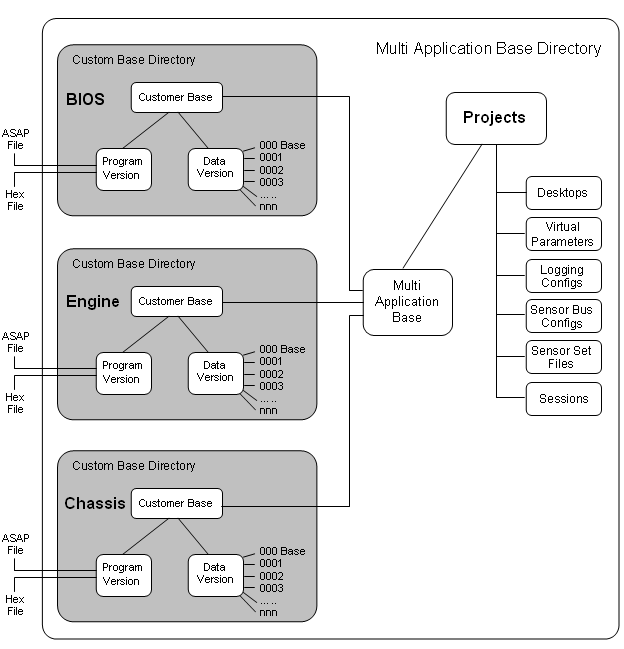

# Project Management

System Monitor has various safeguards to ensure that only the correct data and programs are transferred to an ECU. This is done either by using the Customer Base, which links the ASAP project to the file directories used by System Monitor or Unit.DefManagement.

Each control system has associated ASAP and Hex files, which should be supplied by the ECU manufacturer. System Monitor generates Program and Data Version files from these ASAP and Hex files and only accepts ASAP files from the ASAP project specified in the Customer Base. The Program and Data version files are placed in the Customer Base directory.

A System Monitor Project links the Program and Data version files for an ECU with the Desktop that you use to configure the ECU. When Customer Bases are used, each project is associated with a Multi-Application Base that contains one or more Applications. The Project files are placed in the Multi-Application Base Directory. When Unit.Def support is used, the project file location is used as the base directory.

## Creating a Project

A project requires a Program Version for each Customer Base in the Multi-Application Base therefore Program Versions must be created before you can Create a Project.

The ECU manufacturer may supply Program Versions as well as the ECU files, in which case it will not be necessary to create the Program Versions.
