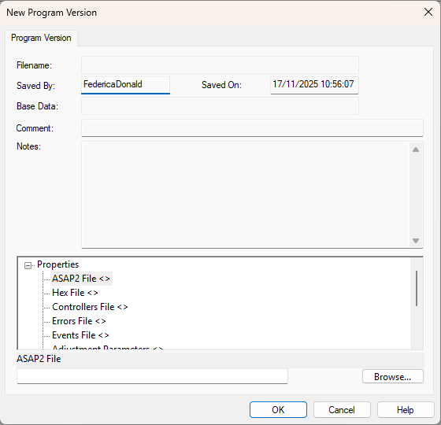

# Program and Data Versions

Each ECU contains one or more controllers, which require programming before use. The ECU manufacturer usually programs the controllers before despatch, however System Monitor can reprogram the ECU. SystemMonitor also uses the program to recognize the configuration of the ECU.

A controller used in this type of application is known as an embedded control system. A description of the embedded control system is supplied in the form of an ASAP file and a Hex File. The ASAP file contains the descriptions of the embedded control system and the Hex file contains the program code and program data.

## File Types

- **Program Version (.pgv)**: Contains ASAP content, program code, and configuration.
- **Data Version (.dtv)**: Contains editable parameters and memory layout.

## Creating Program Versions

1. Start System Monitor.
2. `File > New > Program Version`.
3. Select required files:
   - ASAP2 (required)
   - Hex (required)
   - Controllers (required)
   - Optional: Errors, Events, Sensors, etc.
4. Enter comments and notes.
5. Click OK to generate `.pgv` and `.dtv`.



## Command Line Creation

Syntax:

```
SMv7U /newpgv /asap2 "pathasap2"/hex "pathhex " /controller"pathcontroller" /error"patherror" /event"pathevent" /sensor"pathsensor" /endis"pathendis" /injector"pathinjector" /prm"pathprm" [/customer basename] [/location folder]  [/encrypt encryptionmode]
```

- **pathxxxx**: The full path name of the following files:
    - **pathasap2**: Asap2 File. Must come from the ASAP project specified in the Customer Base.
    - **pathhex**: Hex File. Must match the ASAP2 file and be suitable for the ECU.
    - **pathcontroller**: Controllers File. Must be suitable for the ECU.
    - **patherror**: Errors File. Required if you want to view Errors.
    - **pathevent**: Events File. Required if you want to view Events.
    - **pathsensor**: Sensors File. Required if a Sensor Injector file is loaded (See Sensors).
    - **pathendis**: Sensor Enable/Disable File. Required if you want to Enable and Disable sensors.
    - **pathinjector**: Sensor Injector File. Required if the Sensors file includes injectors.

- **[/customer basename]**: Optional. The name of the Customer Base in which the Program Version is to be stored.

- **[/location folder]**: Optional. The location Base in which the Program Version is to be stored.

- **[/encrypt encryptionmode]**: Optional. The encryption mode should be either:
    - `0`: No encryption
    - `1`: Encrypt PGV files on creation. If this parameter is not specified, no encryption is used.

### Return Codes

`0` success, `1` licence error, `2` invalid command, `3` command failed.
