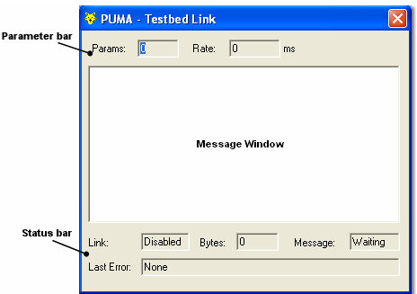

Select: Tools > Testbed to access the Testbed sub-menu.

- **Configure** — Opens the Testbed Properties dialog box (Shortcut CTRL+SHIFT+F5)  
- **Enable Link** — Switches the Testbed Link on and off (Shortcut CTRL+SHIFT+F6)  
- **Message Window** — Opens the Testbed Message window (Shortcut CTRL+SHIFT+F7)

## Link

Selecting/deselecting the **Enable Link** command (Tools menu) switches the link between System Monitor and the testbed on and off.

- When the link is enabled, the ECU is put On-Line.
- Note: If Full Operation mode is selected on the Testbed Properties → Link tab, Live Tune is also enabled.
- If the ECU is taken Off-line or Live Tune is disabled, the Testbed link is automatically disabled.
- When the link is enabled, `PUMA enabled` is displayed on the Status Bar.

System Monitor windows can be used to monitor parameter values while the link is enabled. The status of the link, and the information passing across it, are shown on the Testbed Message Window.

The parameters that System Monitor acquires from the ECU are defined in the Live Logging Configuration. Ensure that Auto Configuration is On so that the correct data is available to send to the testbed and to display on the screen.

## Message

To open the Testbed Message window select Tools > Testbed > Message Window.

The window shows information about the communication between System Monitor and the testbed. It consists of the following areas.

### Parameters Bar

PUMA defines a single block of parameters, and declares the rate at which it will request those parameters.

The Parameters Bar displays the following:

- **Params** — the number of parameters in the block  
- **Rate** — the rate at which these parameters will be requested

### Message Window

Shows the information which is being transferred between System Monitor and the testbed as follows:

- **Commands** — Mnemonics received from the testbed, for example: ‘Select Parameters for Acquisition’. 
- **Arguments** — Information associated with a Command, for example: `Rate: 1s Params: Speed, Gear, Revs..`  
- **Messages** — Mnemonics sent in reply to a request for parameter values, for example: ‘Reply to Acquire Parameters’  
- **Parameter** — Identifiers and values (in engineering units) of parameters associated with a Message.  
- **Debug** — When Debug is on requests repetition of the last message from PUMA to System Monitor or System Monitor to PUMA. Also requests acknowledgements from System Monitor to PUMA that the last message was received.  
- **Watchdog** — When Watchdog is on watchdog time-outs are shown in the following form:
    - `Byte timeout <bto>`, where `bto` is the byte timeout value.  
    - `Message timeout <mto>`, where `mto` is the message timeout value.  
- **Errors** — possible values are:
    - Command not executed  
    - Error during execution `<txt>`, where `<txt>` gives details of the command arguments in error, or the external error that occurred  
    - Command not available

### Status Bar

- **Link** — Indicates the link status:
    - **enabled** — Link is selected, but no bytes have been received  
    - **disabled** — Link is not selected  
    - **active** — Link is selected, and bytes have been received  
    - **inactive** — Link is selected, but a message timeout has occurred
- **Bytes** — the number of bytes since (and including) the last Init command.  
- **Message** — Indicates the current message status:
    - **waiting** — Waiting for a command  
    - **received** — Received a command, not yet sent a confirmation or definitive reply  
    - **confirmed** — Sent a confirmation, not yet sent a definitive reply  
    - **replied** — Sent a definitive reply, waiting for handshake  
    - **repeat** — Waiting for PUMA to repeat a command after a byte timeout
- **Last Error** — Shows the last error that occurred. This is displayed even if the link has since recovered from the error.
