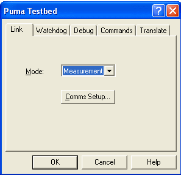
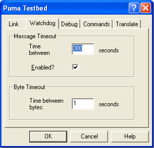
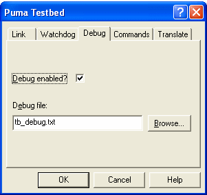
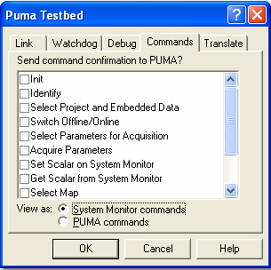
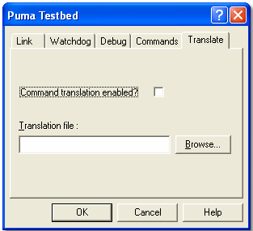

# Testbed Properties

System Monitor must be configured to operate with the testbed.  
To open the Testbed Properties dialog box select: Tools > Testbed > Configure.

## Link

Configure the link between PUMA and System Monitor on the **Link** tab.

The tab has the following controls:

- **Mode** 
    - **Measurement** — PUMA can take measurements from System Monitor. System Monitor only responds to the Initialisation and Data Acquisition commands sent by PUMA.
    - **Full Operation** — System Monitor responds to all the commands sent by PUMA.

- **Comms Setup** — Opens the Serial Comm Setup dialog box. The default settings are chosen to suit most applications.

If the setup is not working, check that it conforms to the requirements of your testbed. The setup is saved as part of the Project settings, so it may need to be edited for each project on which it is used.

## Watchdog

Configure the watchdogs on the link between PUMA and System Monitor on the **Watchdog** tab.

**Message Timeout panel**

- **Time Between** — Enter the timeout period. Range: 0.1 to 36,000 seconds. Resolution: 0.1 seconds. Default: 300 seconds.
- **Enabled?** — When checked, the link is terminated if the time between messages exceeds the value in the Time Between field. The link is re‑established by the PUMA testbed.

**Byte Timeout**

- **Time Between** — System Monitor sends a request to the PUMA testbed to repeat the last command if the time between bytes of the same message is greater than the value in this field. Range: 0.1 to 100 seconds. Resolution: 0.1 seconds. Default: 1 second. This feature is always enabled.

!!! note
    The Watchdog properties cannot be changed while the Testbed Link is Enabled.

## Debug

Use the **Debug** tab to configure the Debug file.

- **Debug Enabled?** — When checked, the text that appears in the Testbed Message window is copied to the Debug file. If the file already exists, text is appended to it.
- **Debug file** — Enter or browse for the name and path of the file where you want to save the debug information. There is no default path but the default file name is `tb_debug.txt`.

The debug filename cannot be changed if the Testbed Link is Enabled, but debug may be switched on or off.

## Commands

Use the **Commands** tab to configure the way System Monitor responds to [PUMA commands](puma-commands.md).

- **Send command confirmation to PUMA?** — When PUMA sends System Monitor a command, it expects a reply within a certain time. If System Monitor cannot execute the command and reply within that time, a command confirmation message may be sent in place of the reply. This gives System Monitor longer to execute the command and allows the definitive reply to be sent later.  
    - When a command check box is selected, that command will be confirmed before the definitive reply is sent.

- **View as** — PUMA uses different command names to System Monitor. Commands can be viewed either as the PUMA command names or as their System Monitor equivalents.

## Translate

Use the **Translate** tab to configure the correspondence between System Monitor and PUMA parameter identifiers.

- **Command translation enabled?** — When selected, the parameter identifiers used by PUMA are translated to those used by System Monitor and vice‑versa.
- **Translation file** — Enter or browse for the name and path of the file where System Monitor can find the equivalents list to translate the parameter identifiers.
