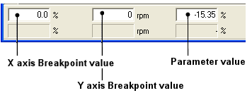
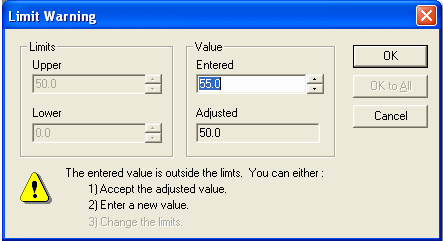
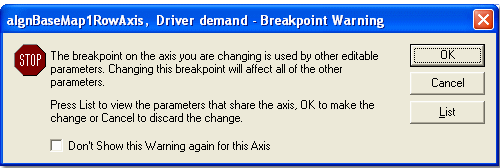

# Changing Parameter Values

Each Parameter is defined in the ASAP file by the ECU manufacturer. The ASAP file either permits or prevents System Monitor from changing the values of an Editable Parameter. If the Editable Parameter values are prevented from being changed, the edit boxes are disabled.

You can only change values of parameters in an Application that is Active and not Read Only.

When a value is changed and accepted, its colour changes to the Greater than / Less than colour (default red/blue) as appropriate. These colours are defined in the Display tab of the Window Properties dialog box. The Scalar Display uses arrow icons to show the direction of value changes.

## Editing options
- Edit commands are available on the Edit Context Menu.
- Use the Maths Bar to carry out mathematical operations on the selected value or values.
- The Breakpoint Values of 1-Axis and 2-Axis Maps can be edited if required.
- To restore values to their original values, select: Edit > Restore or use the Windows Context menu.

## Parameter Edit Mode

A single value of an Editable Parameter can be displayed with Edit Mode either On or Off. Entering a new value turns Edit Mode on and the value is overwritten. Edit Mode is turned on when a single cell is selected using the mouse.

**Edit Mode On**

- Only the text is highlighted.
- Only one cell can be selected.
- The Edit Context Menu is available.
- If Copy is selected, only the value is sent to the clipboard. Paste and Paste Special can only paste the value as text.

To turn Edit Mode Off, press ESC or ENTER.

**Edit Mode Off**

- The whole cell (or row in Scalar or String Windows) is highlighted.
- Blocks of cells can be selected.
- The Windows Context Menu is available.
- If Copy is selected, the value plus a reference to the original parameter is copied to the clipboard. All Paste and Paste Special options can be used.

Pressing a cursor key while the cell is in Edit mode selects the next cell in the direction of the arrow with Edit Mode off.

If multiple values are selected, Edit mode is always off. Editing a number overwrites the first (top left) of the multiple values.

**Changing Parameter Values by Mouse**

Click on the value to be changed and enter a new number to overwrite the existing value. Alternatively, select the appropriate text box in the Edit Bar and enter a new value.

To select more than one value do one of the following:

- Click and Drag to select a continuous rectangle of values. (If the value is in Edit Mode press ESC before dragging)
- Click on a corner of the rectangle of values you want to select. Hold down the SHIFT key and click on the opposite corner
- To select non-continuous values, hold down the CTRL key while clicking on values. (Non-continuous blocks of values cannot be copied.)

If multiple values are selected, entering a value overwrites the first (top left) of the multiple values.

The Maths Bar operates on all the selected values.

!!! note
    It is also possible to change values by dragging with a mouse in a Graphical Map.

**Changing Parameter Values by Keyboard**

Select the value to be changed using the cursor keys and enter a new number to overwrite the existing value. Alternatively, use the TAB key to cycle through the edit boxes in the Edit Bar.

2 axis Map Edit Bar

To select more than one value:

- Using the cursor keys, select a cell at a corner of the rectangle of values you want to select. Hold down the SHIFT key and select a cell at the opposite corner.
- To select non-continuous values, hold down the CTRL key while using the cursor keys, press the SPACE bar to include values. (Non-continuous blocks of values cannot be copied.)

If multiple values are selected, entering a new value overwrites the first (top left) of the multiple values. The Maths Bar operates on all the selected values.

## Value Limit Warning

Each Parameter has an upper and lower limit that is set in the ASAP file. The limits can be viewed in the Conversion tab of the Parameter Properties dialog box.

If a value is changed so that it is outside the limits, the Limit Warning dialog box opens.

The Upper and Lower limits are shown in the Limits panel. If the Parameter Properties can be edited, the Upper and Lower limits text boxes are editable and the limits can be changed.

In the Value panel:

- Entered — Shows the out-of-range number that was entered. If you edit this box to a number that is within range, the new number is accepted when you click OK.
- Adjusted — System Monitor automatically suggests a new number, which is the value of the limit nearest to the out-of-range number that was entered. If you click OK without editing a number in the Entered text box, the Adjusted number is accepted.

Buttons:

- OK — Replaces the selected value with the value in the Entered text box provided it is within limits.
  - If the value in the Entered text box is not within limits, the selected value is replaced by the value in the Adjusted text box.
  - If multiple values are being changed, steps through the values one at a time.
- OK to All — Available for multiple values only. As OK but applies the same change to all the values.
- Cancel — The change is ignored and the original value is restored.

## Changing Breakpoint Values

### Mouse operation
To select an X-axis Breakpoint click on the column header. To select a Y-axis Breakpoint click on the row. When a cell is selected, it changes to Edit Mode. Enter a new value to overwrite the existing value.

!!! note
    If Orientation is selected in the Window System Menu, the axes are rotated.

Alternatively, click on the appropriate edit box in the Edit Bar. Select the required breakpoint edit box and overwrite the value.

### Keyboard operation

Use the cursor keys to select a cell that uses the breakpoint that you want to change.

Use the TAB key to cycle through the edit boxes in the Edit Bar. The TAB key then returns to the value in the map table.

Select the breakpoint that you want to change and enter a new value to overwrite the existing value.

## Breakpoint Warning

Changing Breakpoint values affects the axis wherever it is used, not just in the current Window. If the axis is used by other Parameters, System Monitor displays a Breakpoint Warning.

To prevent this box from being displayed again, select: Don’t show this Warning again for this Axis.

Click List to display a list of all the Parameters that use the axis that you are editing to help you to determine the effect of the change.

## Breakpoint Monotony

All Breakpoint values must either increase or decrease along the axis. This restriction is called Monotony. The direction of monotony is set in the ASAP file and can be viewed in General tab of the Axis Properties dialog box.

This means that a breakpoint value cannot be higher than the next highest value or lower than the next lowest. If you enter a value that breaks this rule, a warning is shown and the value is not accepted.

Click OK to close the warning.

The new value that was entered is replaced by the original value. Only values that are within the surrounding breakpoint values can be accepted.