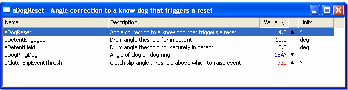
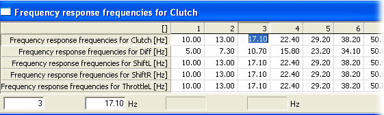
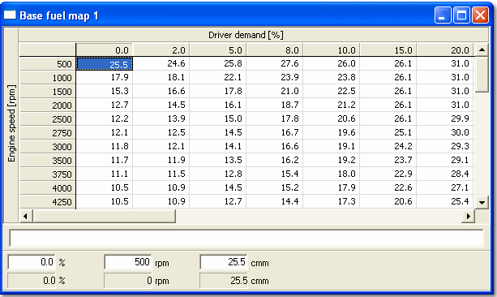
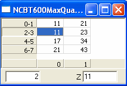
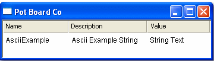

# Editable Parameters

Editable Parameters are values within the ECU that can be modified to optimise engine performance. These parameters are defined in the ASAP file by the ECU manufacturer and may be edited depending on permissions.

## Scalar Parameters
A **Scalar** parameter holds a single constant value.

**Scalar Edit Window**

- Displays multiple Scalar parameters in rows.
- Columns include:
  - **Name/Description**: Configurable via Window Properties.
  - **Value**: Editable; colour changes on acceptance (default red/blue).
  - **Trend Arrow**: Indicates increase or decrease.
  - **Units**: Shown if Engineering format is selected.
  - **Address**: Shown if Raw Hex or Binary format is selected.

!!! note
    Scalar parameters can also be edited in a Grid window.

## 1-Axis Maps

A **1-Axis Map** is a one-dimensional lookup table. The output value depends on the selected **Breakpoint** on the axis.

**Features**

- Active cell outlined in black when ECU is online.
- Colour changes on value acceptance.
- Optional **String Bar** displays associated string values.
- **Edit Bar** shows Breakpoint and Output values.
- Display options: Engineering, Raw Hex, or Address.
- Graphical format available.
- Orientation can be rotated via System Menu.

### Multiple Parameters
- A 1-Axis Map window can include multiple parameters sharing a common axis.
- Parameters not sharing the axis are excluded with a warning.
- Orientation can be toggled to display parameters in columns.

## 2-Axis Maps

A **2-Axis Map** is a two-dimensional lookup table. Output depends on selected Breakpoints on both axes.

**Features**

- Output and Breakpoint values are editable; colour changes on acceptance (default red/blue).
- Active cell outlined in black when ECU is online.
- Grid structure includes:
    - X-axis identifier name row
    - X-axis Breakpoint values row
    - Y-axis rows with Output values and Y-axis identifier/Breakpoints
- Optional **String Bar** displays associated string values.
- **Edit Bar** shows X-axis Breakpoint, Y-axis Breakpoint, and selected cell values; non-editable boxes display Index Parameters and Output value when online.
- Window and axis titles can display Name, Description, or both (configured in Window Properties).
- Display options: Engineering, Raw Hex, or Address format.
- Graphical format available.
- Live Tune Overview minimizes empty cells for better visibility.
- Orientation can be exchanged via System Menu.
- Appearance controls available in Window Properties Display tab.

## Arrays

An **Array** is a one-dimensional ordered group of values selected by an index.

**Features**

- Only one Array parameter per window.
- Editable values with colour change on acceptance.
- Grid layout includes:
  - Output values (rows/columns configurable)
  - Index row
- Optional **String Bar** and **Edit Bar**
- Window title can show Name, Description, or both

## Strings

A **String** parameter outputs text rather than numerical values.

**Features**

- Multiple String parameters can be displayed.
- Editable within defined length (set in ASAP file).
- Columns include:
  - **Name/Description**
  - **Value**
- Column widths and sorting are configurable.
- Can be associated with Maps or Arrays.

!!! note
    - Editable Parameters must be part of an **Active Application** and not marked as **Read Only**.
    - Editing permissions are controlled by the ASAP file.