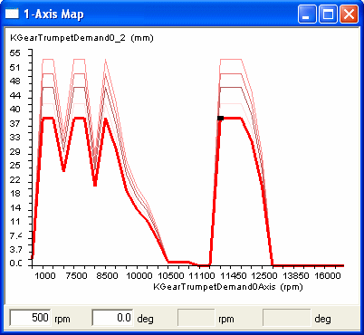
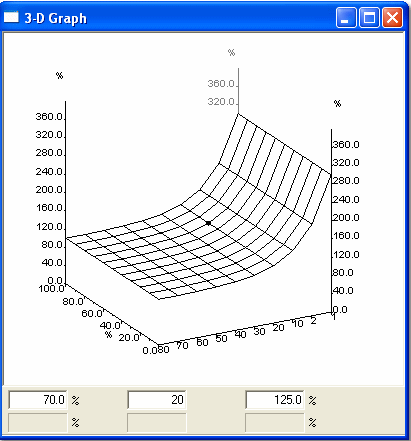
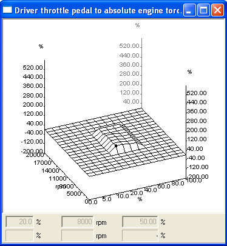
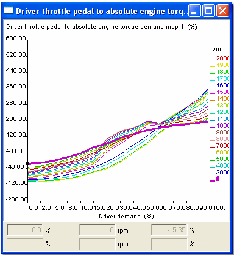
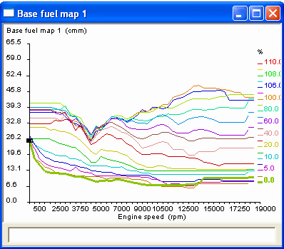
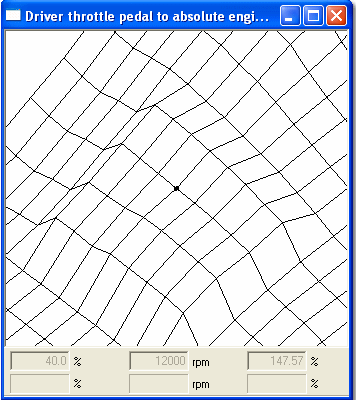
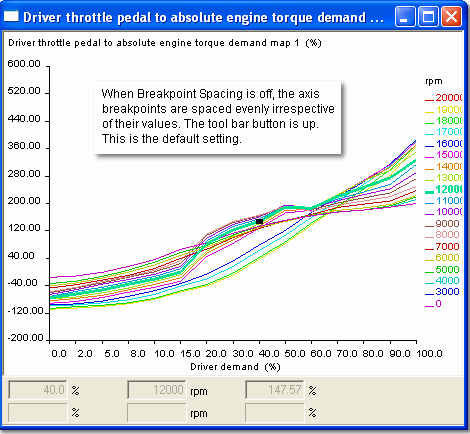

# Graphical Maps

1-axis and 2-axis maps can be displayed in several graphical formats. Select the view format from the System menu for the Window or step through the options with the View Mode button on the Map Bar.

All Graphical Views can be zoomed. 2‑axis Graphical Views can also be rotated. Breakpoint spacing can be Even or Proportional. Values can be changed in all Graphical Views except Difference View. Values can only be changed in active applications.

## Available Views

### 1-axis Map

- Graphical View – 1 axis  
   A two‑dimensional graph of Parameter value plotted against Index Value. The display includes a plot for each Parameter in the Window. The name of the currently selected Parameter is displayed at the top of the Window. The trace of the currently selected Parameter is shown bold in the colour selected for Active Map in the Display tab of the Window Properties (Display sheet). Remaining traces use the colour selected for Inactive Map.
      - Axis upper and lower values are set in the relevant Conversion dialog boxes (see Parameter Properties – Conversion sheet and Axis Properties – Conversion). Axis subdivisions and labels are generated automatically.
      - Breakpoint Spacing can be Even or Proportional.
      - You can select all values of the selected parameter with the Select All button on the Map Bar.
      - Values can be changed in this view.

### 2-axis Map
- Graphical View – 2 axis  
   A three‑dimensional graph of Parameter value plotted against two Index Values (X and Y).
      - Axis upper and lower values are set in the relevant Conversion dialog boxes (see Parameter Properties – Conversion sheet and Axis Properties – Conversion). Axis subdivisions and labels are generated automatically.
      - Breakpoint Spacing can be Even or Proportional.
      - Hidden lines are removed. To see values below the surface, use End View or Slice View.
      - The 3D view can be rotated and zoomed. Values can be changed in Graphical View.

- Difference View (1‑axis and 2‑axis)  
   The Difference value is the amount by which the current value in the Edit Buffer differs from the value in the Data Version. Difference View plots the Difference value against the Index Value(s). Values cannot be changed in Difference View.
      - Unchanged values are set to zero.
      - 1‑axis Difference View: two‑dimensional graph of Difference value plotted against Index Value. Only one Parameter is shown; the name of the currently selected Parameter is shown at the top. The largest difference (positive or negative) is used to set the axis upper and lower values.
      - 2‑axis Difference View: three‑dimensional graph of Difference value plotted against two Index Values (X and Y). The upper axis value equals that used in Graphical View – 2 axis; the lower axis value is the same magnitude but negative. The 2‑axis Difference View can be rotated.
      - Axis subdivisions and labels are generated automatically. Breakpoint Spacing can be Even or Proportional.
      - Both Difference Views can be zoomed.

- End View (2‑axis only)  
   A two‑dimensional graph of Parameter value plotted against the X Index Value for each Y Index Value. The display includes a plot for each Y Index Value.
      - The trace of the currently selected Y Index Value is shown bold in the colour selected for Active Map; other traces use the colour selected for Inactive Map.
      - Axis upper and lower values are set in the relevant Conversion dialog boxes. Axis subdivisions and labels are generated automatically.
      - Breakpoint Spacing can be Even or Proportional.
      - Values can be edited in this view.

- Slice View (2‑axis only, available in Graphical View)  
   Selected by buttons on the Map Bar.
      - Slice X: two‑dimensional graph of Parameter value plotted against the X Index Value for the Y Index breakpoint that includes the selected value. The trace for the selected breakpoint is shown bold in the Active Map colour; traces for higher Y Index values (behind) are shown in the Inactive Map colour.
      - Slice Y: two‑dimensional graph of Parameter value plotted against the Y Index Value for the X Index breakpoint that includes the selected value. The trace for the selected breakpoint is shown bold in the Active Map colour; traces for higher X Index values (behind) are shown in the Inactive Map colour.
      - Axis upper and lower values are set in the relevant Conversion dialog boxes. Axis subdivisions and labels are generated automatically.
      - Breakpoint Spacing can be Even or Proportional.
      - These views can be zoomed and their values are editable.#

## Zooming a Graphical view

All Graphical Views can be zoomed using buttons on the Map Bar:

- Zoom in — increases the size of the view by 50%.
- Zoom out — cancels each Zoom In setting sequentially.

When any level of Zoom In is selected, the view is centred on the currently selected value. As soon as a value is selected or moved, the display is redrawn to place the value at the centre (the “landscape” appears to move under the point).

To select a value:

- On a 3D display
      - Click on an intersection on the surface; or
      - Use the cursor keys to move around the surface.
- On a 2D display
      - Click on the trace where it is intersected by a breakpoint; or
      - Use the left/right cursor keys to move along the trace and the up/down keys to select a trace.
- For either display
      - Switch to Engineering View; select a value using the mouse or keyboard, then return to Graphical View.

!!! tip
      Use Alt+G to toggle between Graphical and Engineering views.

The Zoom setting is retained for a Window even if its View mode is changed.

For 2D displays, the vertical axis can be scaled using AutoZoom so that the traces fit the plot area.

## Breakpoint Spacing

All Graphical Views can be shown with Breakpoint Spacing either Even or Proportional using the button on the Map Bar.

- Even Breakpoint Spacing
- Proportional Breakpoint Spacing

## Rotating a Graphical view

The three‑dimensional Graphical View for 2‑axis Maps can be rotated using the Mouse or toolbar buttons:

- Toolbar buttons — four buttons rotate the display left/right or up/down in 10° increments.
- Mouse — click anywhere on the Map window (take care not to select a value) and drag the cursor; the front of the display follows the cursor movement.

## Changing Values in a Graphical view

Parameter values can be changed in any Graphical View except Difference View. Values can only be changed in active applications.

!!! note
   In a 1‑axis Graphical View you can select all values of the selected parameter with the Select All button on the Map Bar. In all other Graphical Views you can only select one value at a time. To change multiple values.

Steps to change a value in a Graphical View:

1. Select a value:
    - On a 3D display: click on an intersection on the surface or use the cursor keys to move around the surface.
    - On a 2D display: click on the trace where it is intersected by a breakpoint or use the left/right cursor keys to move along the trace and the up/down keys to select a trace.
    - Or switch to Engineering View, select a value using the mouse or keyboard, then return to Graphical View. (Tip: Use Alt+G to toggle between Graphical and Engineering views.)
    - The selected value is identified by a black spot. The Breakpoints and Value of the selected point are shown in the Edit Bar.
2. Change the value:
    - By mouse — drag the value up or down. If the view is Zoomed In, the display continually redraws to place the value at the centre (the landscape appears to move under the point).
    - By keyboard — use the TAB key to cycle through the boxes in the Edit Bar.
3. Enter a new value.
4. Press ENTER to accept the value and redraw the Map.

!!! note
   The Maths Bar can be used to change values selected in a Graphical View.
