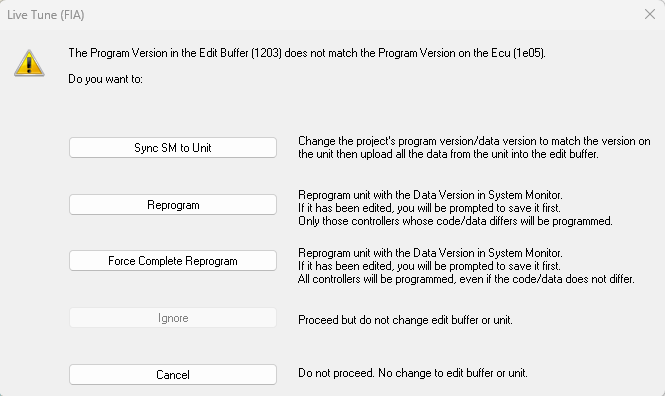

# Live Tune

When Live Tune is on, the Edit Buffer and the ECU RAM are kept synchronised — any changes in the Edit Buffer are downloaded to the ECU as soon as they occur.

## Toggling Live Tune
To toggle Live Tune on and off select: ECU > Live Updates.  
The status of Live Tune is shown on the Comms Bar.

!!! note
    The data changes only affect the ECU RAM. To apply the changes to the vehicle systems, the ECU must be operating from RAM. The type of memory being used by the ECU is selected from the Run from ROM and Run from RAM commands on the ECU Menu.

## If the Data Version Does Not Match
If the Data Version in the Edit Buffer does not match the one in the ECU, the following message is opened for each Application when you start Live Updates. The message presents these options:

- **Sync SM to Unit**  
  Synchronises the files in System Monitor to match those in the Unit. The specified files are opened in System Monitor, replacing those that are already open. If a file cannot be found, a new file is created using the filename and modification information taken from the unit. Uploads data and places it in the Edit Buffer. Files and data which are the same as already in System Monitor are not uploaded.

- **Reprogram**  
  Reprograms the ECU then downloads the data changes in the Edit Buffer to the ECU.

- **Force Complete Reprogram**  
  Forces a Complete Reprogram then downloads the data changes in the Edit Buffer to the ECU.

- **Ignore**  
  Closes the message box. No changes are made. The download process continues with the next Application.

- **Cancel**  
  Closes the message box. No changes are made.

# Live Auto Tune

Live Auto Tune assists with manual testbed tuning. It is used in conjunction with Live Tune and the Adjustment Board.

## Definition File and Parameters
The Live Auto Tune Definition File defines a set of Live Auto Tune Parameters. A Live Auto Tune Parameter defines a group of 2‑axis maps and an adjustment parameter. The maps in a Live Auto Tune Parameter share the same axes (for example, throttle position vs engine speed).

Typically, Live Auto Tune Parameters are provided for:
- ignition,
- injection quantity,
- injection end angle, and
- nominal lambda.

Turbocharged engines may have additional parameters for boost pressure and waste gate control.

The Parameter Properties - Live Auto Tune Sheet gives information about the selected Live Auto Tune Parameter.

## Tune Groups and Z Axis
The Live Auto Tune Parameters all have the same number of maps in a set order (e.g. 1, 2, 3). The group of maps at the same level in all the Live Auto Tune Parameters is called a Tune Group. Typically, the Tune Groups are selected for different operating conditions such as “Optimum Power”, “Minimum Consumption” or “Wet Racing”.

The active Tune Group can be selected by:
- the result of a calculation in the ECU,
- the value of a measurement parameter, or
- the driver using a cockpit‑mounted switch.

The index that selects the Tune Group is called the Z axis.

## Operation and Adjustments
As a test is run, the various indexes and controls select a value on one of the maps in each Live Auto Tune Parameter. The Adjustment Parameter is then applied to this value. If the Adjustment Parameter is associated with a control on the Adjustment Board, turning the control applies the adjustment. The way in which the adjustment is applied is defined by the Correction type in the Parameter Properties.

To ensure that a value is selected properly, the Live Auto Tune Parameter defines breakpoint tolerances which override the breakpoint tolerances set for each map (see Parameter Properties - 1‑Axis Map Sheet).

## Saving Adjustments
When you are satisfied with the changes, update the data version in the ECU by selecting: ECU > Save Auto Tune Adjustment.
