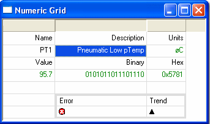
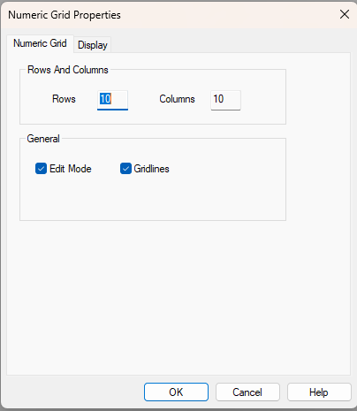
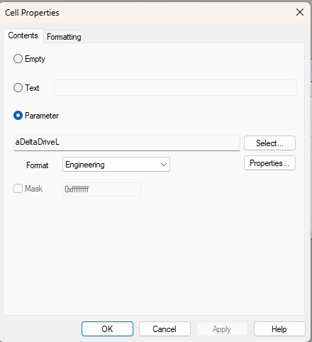
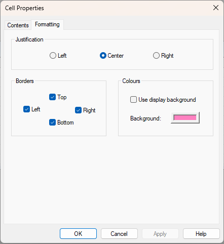

# Grid Display
The Grid Display is a flexible, spreadsheet-style layout that allows text and attributes of Measurement or Scalar Parameters to be placed in cells. It is commonly used to create customised views for specific operations.

## Features

- Editable Parameters can be highlighted using a different background colour.
- Values not included in the Live Logging Configuration are shown as a dash.
- Appearance controls are available via the Window Properties dialog and System Menu.
- Grid Displays can replicate the look and function of custom pages from System Monitor Version 6.

## Edit Mode
Edit Mode allows modification of cell content and layout.

- Enabled by default for new Grid Windows.
- When enabled:
  - Column headers are shown.
  - Column widths can be changed.
  - Grid Cell Context Menu is available.
  - Text and cell properties can be edited.

To disable Edit Mode, clear the checkbox in the Numeric Grid tab of the Window Properties dialog.

## Creating a Grid Window
1. Select: `Desktop > Window > Grid`
2. Configure:
    - **Rows and Columns**: Set initial size.
    - **General Panel**:
        - Edit Mode: Toggle cell editing.
        - Gridlines: Show/hide gridlines.

Click **OK** to create the window. Cells must be configured individually.

## Selecting Cells

- **Single**: Click or use cursor keys.
- **Multiple**:
    - Mouse: SHIFT or CTRL + click.
    - Keyboard: SHIFT or CTRL + cursor keys + SPACE.

!!! note
    Non-continuous blocks cannot be copied.

## Cell Properties

To edit a cell:

1. Ensure Edit Mode is enabled.
2. Click the cell.
3. Press ESC to highlight.
4. Right-click > **Properties**

### Contents Tab

- **Empty**: Clears cell.
- **Text**: Enter free text.
- **Parameter**:
    - Select a parameter.
    - Choose attribute to display (e.g. Engineering value).
    - Optional bit masking for logical display.

### Formatting Tab

- **Justification**: Set text alignment.
- **Borders**: Add thick borders.
- **Colours**:
    - Use default or custom background colour.

## Insert/Delete Rows or Columns

- Use Grid Cell Context Menu:
    - **Insert**: Specify number and placement.
    - **Delete**: Remove selected rows/columns or cell contents.
