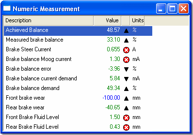
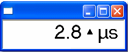

# Numeric Display

The Numeric Display shows one or more Measurement Parameters in a tabular format. Each parameter is displayed in a row with descriptive text.

## Features
- Each row includes:
    - **Name / Description**: Configurable via the Parameters Sheet in the Window Properties dialog.
    - **Value**: Display format set in the Parameters Sheet or System Menu.
    - **Units**: Engineering units symbol or text.
    - **Status Icon**: Indicates value change or error condition.
- Column widths can be adjusted.
- Parameters can be sorted.
- If a parameter is not included in the Live Logging Configuration, its value is replaced by a dash.

## Big Number Display

A Big Number Display is a specialised Numeric Display created when a single Measurement Parameter is selected via Parameter Explorer.

### Differences from Numeric Display

- Uses the default large font.
- Name column is hidden.
- Parameter Name/Description shown in the title bar.
- Column headings are hidden.
