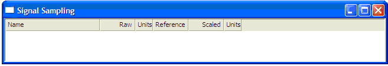

# Signal Sampling Display

A signal sampling display can be added to a page by selecting **Desktop > Window > Signal Sampling**.

The signal sampling tool allows one or more input signal parameters to be sampled either independently or simultaneously. Parameters can be added to the display by dragging them into the display from the parameter explorer. They can be deleted either by selecting the parameter in the display and pressing the ‘delete’ key or via the parameter explorer.

Multiple signal sampling displays can be displayed on one page.

Each input signal parameter is displayed as a row with the following columns:

- **Name**: The name of the input signal parameter. This is set in the input signal configuration dialog.
- **Raw**: The raw (un-scaled) value of the input signal.
- **Units**: The units of the raw value of the input signal.
- **Reference**: The scaled value the signal should read when sampled. This value is user editable.
- **Scaled**: The current scaled value of the input signal including the offset. This is the value that will be logged.
- **Units**: The units of the scaled value of the input signal.

Input signal parameters can be sampled from the current value using one of the following options, all of which are available via both menus and keyboard shortcuts:

- **Selected Parameter Only**: This will simultaneously sample the selected parameter(s) only.
- **Sample Entire Display**: This will simultaneously sample all parameters within the currently selected input signal display.
- **Input Signal Sample Entire Page**: This is selected via the Logging menu. This will simultaneously sample all parameters on all signal sampling displays on the current page.

!!! note
    There must be an active link to the unit for the sampling functionality to be selectable. If not, then the sampling menu options will be disabled.

If one or more parameters have been sampled, then the user will need to download the logging configuration to the unit so that the changes are applied. The ECU bar will indicate if the users’ current SM logging configuration file differs from the one on the unit.