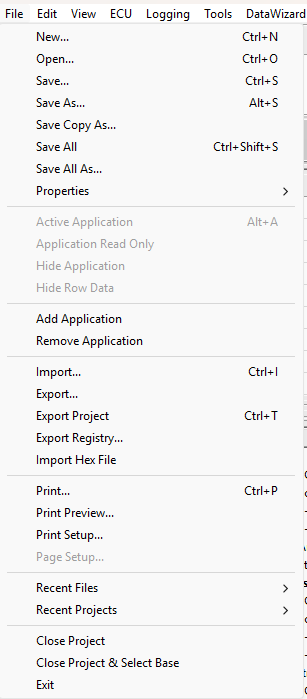
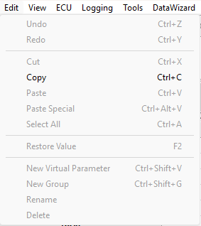
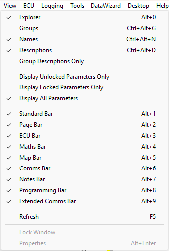
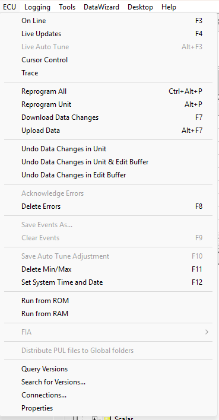
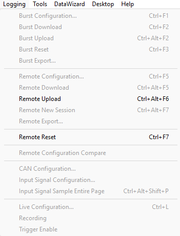
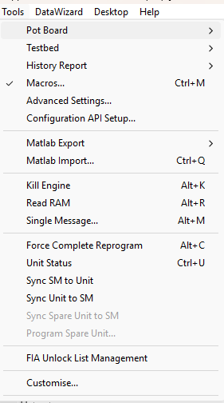
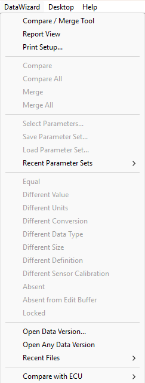

# Menus

| Menu | Description | Shortcut |
|---|---|---|
| File | Work on Project files. Includes printing. | ALT+F |
| Edit | Work on parameters and their values. Includes Parameter Explorer commands. | ALT+E |
| View | Control the appearance of the Desktop. | ALT+V |
| ECU | Work with ECUs. Shown when a Project is open. | ALT+U |
| Logging | Work with logging configuration. Shown when a Project is open. | ALT+L |
| Tools | Access additional tools within System Monitor. | ALT+T |
| Data Wizard | Work with Data Wizard. Shown when a Project is open. | ALT+W |
| Desktop | Create and edit Pages and Windows. Shown when a Project is open. | ALT+D |

### File Menu

Options to manage files and projects.

### Edit Menu

Options to edit projects and parameters.

### View Menu

Options to enable and disable different displays and toolbars.

### ECU Menu

Options to interact with the connected ECU.

### Logging Menu

Access logging configuration and controls.

### Tools Menu

Options to access additional tools.

### Data Wizard Menu

Access to Data Wizard features. Data Wizard compares the contents of the Edit Buffer with one or more previously created Data Versions, known as Candidate Data Versions. Using the Merge facility parameters in the current Data Version can be overwritten with those in the Candidate Data Versions.

### Desktop Menu

Options to customise the desktop layout. A Desktop consists of one or more pages that contain Windows. Every Project has a Desktop associated with it. Any Project can use any Desktop in the Multi-Application Base but can only have one Desktop loaded at any one time.

