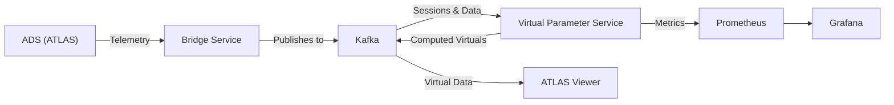

# Virtual Parameter Service

The **Virtual Parameter Service (VPS)** simplifies the calculation of virtual parameters — parameters defined as FDL (Function Definition Language) functions in ECU logging configurations. Traditionally calculated on demand by downstream clients such as ATLAS, the VPS performs these calculations **in real time** and writes the results back to the broker, removing the need for client-side recalculation.

## Key Features

| Feature | Description |
|---|---|
| **Real-time virtual parameter calculation** | Automatically computes FDL-defined virtual parameters as live telemetry data arrives. |
| **Stream API integration** | Reads source sessions from Kafka and writes computed results back as new virtual sessions. |
| **Session lifecycle management** | Detects live sessions, creates associated virtual sessions, and manages their full lifecycle. |
| **Prometheus metrics** | Exposes detailed operational metrics for monitoring via Prometheus and Grafana. |
| **Docker-first deployment** | Ships as a Docker image with a provided `docker-compose.yaml` for full-stack orchestration. |
| **Configurable buffering** | Tunable buffering window and sliding window percentage to balance latency and throughput. |

## How It Works

At a high level, the VPS operates as a background service that:

1. **Connects** to a Kafka broker via the Stream API.
2. **Listens** for live telemetry sessions published by ADS through the Bridge Service.
3. **Reads** configuration packets containing parameter definitions and FDL expressions.
4. **Compiles** FDL expressions into executable functions at runtime.
5. **Subscribes** to source parameter data streams and buffers incoming samples.
6. **Calculates** virtual parameter values in real time using the compiled functions.
7. **Writes** the computed results back to the Stream API as an associate session.

Downstream clients can then consume these pre-calculated virtual parameters directly from the stream, instead of computing them locally.

## Use Cases

- **Eliminating redundant calculations** — Instead of every client independently computing the same virtual parameters, the VPS computes them once and publishes the results.
- **Ensuring consistency** — All consumers receive identical computed values, removing discrepancies between different client implementations.
- **Reducing client load** — Downstream applications no longer need to include FDL evaluation logic, simplifying their architecture.
- **Centralised monitoring** — Operators can track the health and throughput of virtual parameter processing from a single Grafana dashboard.
