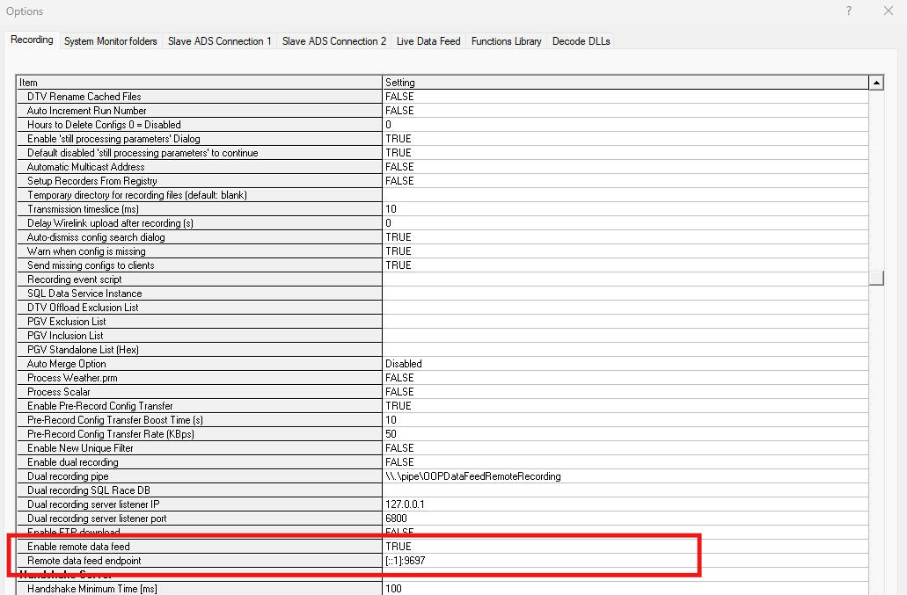

# Introduction
The Bridge Service decodes a raw stream of quads from an ATLAS Data Server (ADS), converting the data to engineering 
values then into the Stream Protocol via the Stream API. It includes components to manage sessions, configuration, 
metadata etc. 
All RDA protected data will be filtered out at this point, based on the active team license, so any downstream 
components will only receive data available to the team. 

# Setup

**Prerequisite:**

Kafka broker - The Bridge service needs to be configured to write to a Kafka broker. As you can see in the above example, the config file points to a broker url, which is hosting kafka locally on the same machine as the ADS.

To enable the Bridge Service, set "Enable remote data feed" setting to "True" in ADS | Tools | Options | Recording tab | General

Restart ADS once the setting is applied. 

Once the data is published on Kafka, users can use the Stream API to consume the data. For more information, please refer to the [Stream API Sample code](https://github.com/mat-docs/MA.Streaming.Api.UsageSample)

!!! note
    Currently, ADS will launch the Bridge Service in a separate command prompt for ease of testing/validation and diagnostics.

## UNIX Timestamps

Timestamps from Motion Applied ECUs are relative to midnight local time. To convert the timestamps to UNIX epoch time in UTC, 
the date and the local timezone offset on the machine hosting the bridge service is used. 

!!! warning
    It also applies to File Telemetry Recorders and Multi-Session Offload Recorders in addition to live telemetry. 
    Replaying a raw file on a machine that is incorrectly configured could publish timestamps at the incorrect date and 
    timezone.
