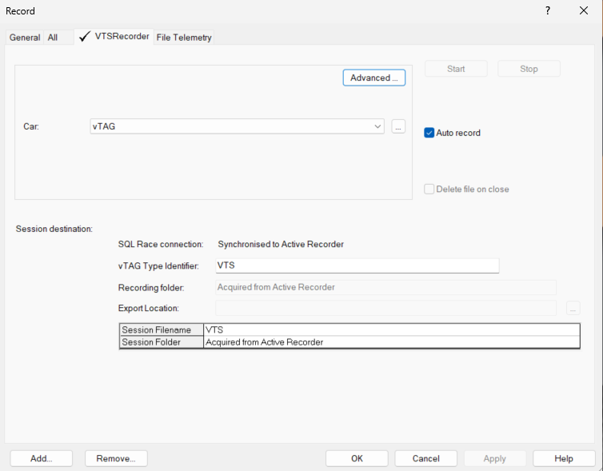

# Getting Started with vTAG Server

This guide provides the fastest, simplest path to building and running your first vTAG Server application — from a blank Simulink model to live outputs in ATLAS.

## 1. Install & Verify Required Components

Before you begin, ensure you have the following:

**Software**

- MATLAB + Simulink
- System Monitor
- ATLAS
- ADS (Atlas Data Server) 

**Licenses**

- MCT licence (needed for Measurement Write blocks)
- MCT Atlas Toolbox licence (required for Atlas 10 Source block)
- MCT vTAG HSP licence (required to build vTAG applications)

!!! note
    To learn more about licences, please contact [sales](mailto:sales@motionapplied.com).

**Download**

Download the latest vTAG Server installation package from [Motion Applied Portal](https://portal.mclarenapplied.com/portal/Downloads/Software#vTAG%20Server).

## 2. Create Your First vTAG Server Model

1. Open Simulink → select **New model**.
2. In the Library Browser, find `MCT ATLAS Toolbox > ATLAS10`.
3. Add an **Atlas 10 Source block**:
    - Pick a parameter (e.g., `vehicle_speed`)
    - Select the correct originating application
    - You can define sample times, modes, data types, etc. as needed by clicking into the block.
4. Add simple logic — for example, a **Gain block** multiplying by 2.
5. Add a **Measurement Write block**:
    - Name the output parameter (e.g., `vehicle_speed_x2`)
6. Save the model.

You now have the simplest valid vTAG model:

```
Input → Logic → Output
```

!!! question "What are the blocks in MCT ATLAS Toolbox?"
    - ATLAS 10 Source – Reads a parameter from a live ADS data stream or a historical session file and provides it as an input to your Simulink model.
    - ATLAS 10 Source Type – Outputs a status code indicating whether the connected data source is live, historical, or unavailable to support diagnostics or logic switching.
    - ATLAS 10 Control – Allows you to run a Simulink simulation driven by ATLAS while a session is loaded, effectively acting as a local replacement for vTAG Server during testing. *Not required for vTAG Server.*
    - ATLAS 10 Sink – Sends Simulink‑generated signals back into ATLAS during simulation so they appear as channels in the viewer.*Not required for vTAG Server.*

## 3. Build the Application (pgv)

Before building, configure the model:

1. Open **Model Settings** → **Code Generation**.
2. On **System Target File** Select **vTAG TLC**.
3. Under **Build Process > Toolchain** Choose your Microsoft Visual C compiler. 
4. Click **Ok**.

Run the build command in MATLAB to create the PGV file:

```matlab
vtag.build( ...
     'modelName', 'your_model_name', ...
     'Application', 9,
     'PGVVersion', 'MyFirstVtagApp', ...
     'SMBase', 'path/to/SystemMonitor/base' ...
);
```

For more information on the build command and its arguments type `help vtag.build` in MATLAB Command Window. 

After running the build command, go to the SMBase folder and find the folder generated with PGVVersion (e.g., `MyFirstVtagApp`). Inside, you will find the generated `.pgv`, `.dtv` and `.dvb` files. To learn more about projects, see [System Monitor](../../configure/system-monitor/projects/index.md) documentation.

## 4. Reprogram the vECU

Now that we have the PGV file, we need to reprogram it onto the virtual unit. 

1. Open **System Monitor**.
2. Create a **New Project** (`File > New > Project).
3. Select BIOS Program Version 
    - If vtag.build didn't specify a BIOS version, the default is 4; select a 1000 BIOS Version.
4. Select all of the App IDs in the selected base and load the generated PGVs.
5. Click **Finish**
6. Connect to the **vTAG Server IP**.
    - The vTAG Server IP can be found in vTAG Server under `Own IP`. 
7. In vTAG Server, click **Reset > Reset vECU**.
8. Reprogram the unit (F3).

## 5. Configure ADS

Configure ADS:

1. Open **ADS**.
2. Add a **File Telemetry Recorder** (simulated data source).
3. Add a **VTS Recorder** (records vTAG Server output).
4. Start **ADS recording**.



Check that **vTAG Server** shows active in System Monitor.

## 6. View in ATLAS Viewer

1. Open ATLAS Viewer and a workbook.
2. Open Session Browser (`Ctrl + L`) and add a new [Data Server Telemetry Recorder](../../visualise/atlas/handling-data/recorders/data-server.md), enable auto-record and add to set.
3. View your live output parameter streaming in.

This setup lets you simulate a live telemetry environment without hardware.