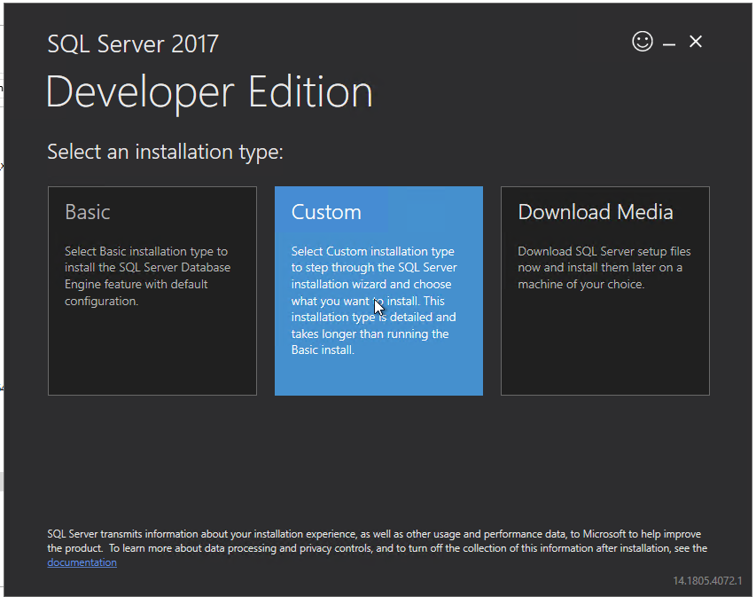
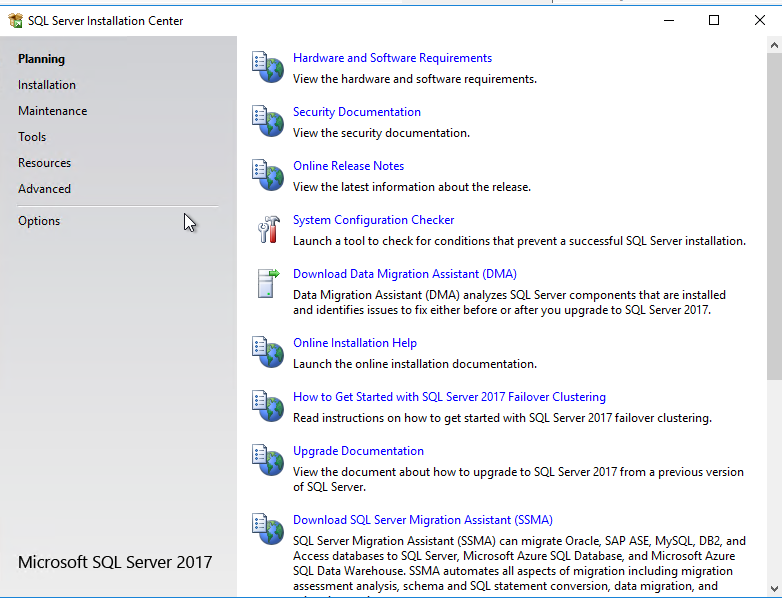
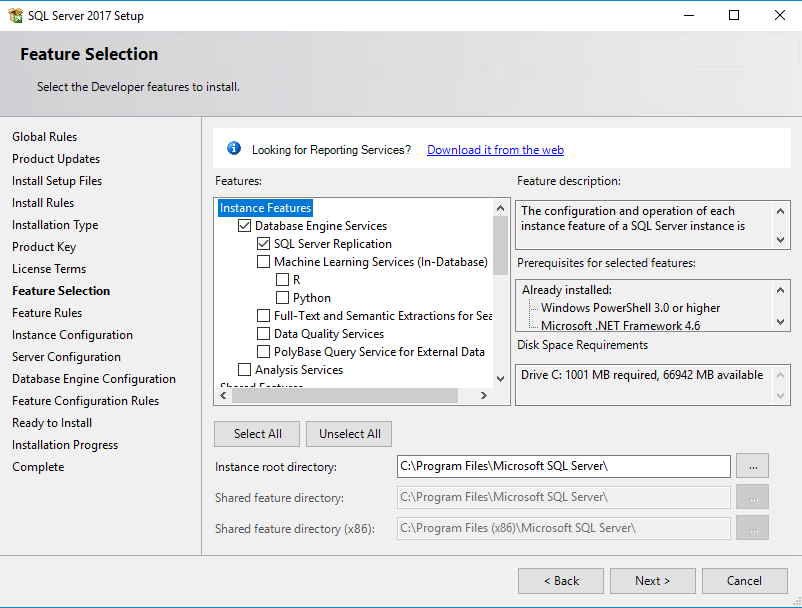
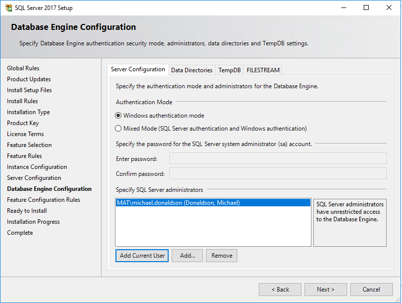
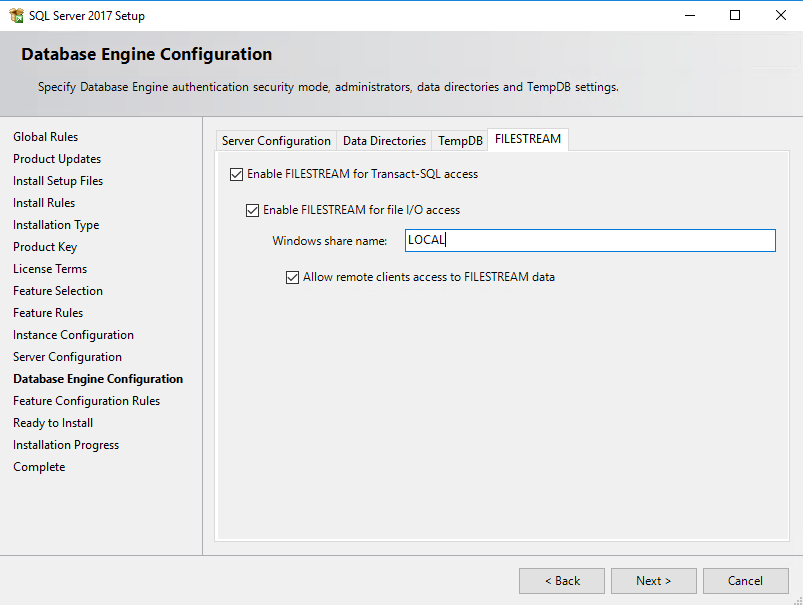
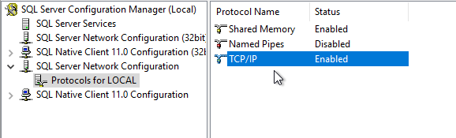
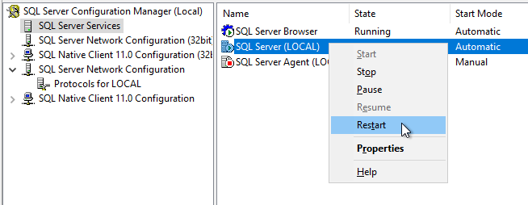
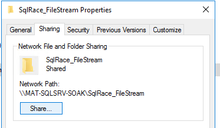
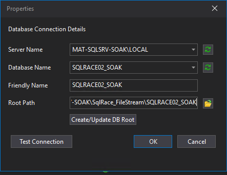

# Setup Guide

This guide will cover the process of installing SQL Server, setting up a SQL Race Database, and connecting your database to ATLAS ready to start reading and writing data.

## Installing SQLServer

Download and install SQL Server 2019 or 2022 from the [Microsoft SQL Server Downloads](https://www.microsoft.com/en-us/sql-server/sql-server-downloads) page. 

!!! note
    Express will work too but it has limited size so it's not recommended to use for larger datasets. 

{: style="width:75%;"}

Once the installer has been downloaded, run it and select the 'Custom' installation type and follow the prompts to complete the installation after which the installation center will open. 

{: style="width:75%;"}

Go to **Installation** and select **New SQL Server stand-alone installation** at the top. Click through the wizard, if you need SQL Server Replication, make sure the checkbox is selected on the **Feature Selection** page.

{: style="width:75%;"}

Give the instance a name on the **Instance Configuration** page. It's recommended to use a named instance (like `LOCAL`) instead of leaving it blank, which does not work well with SQL Race Functions. 

{: style="width:75%;"}

In **Database Engine Configuration** ensure Windows authentication mode is selected and add the current user to the SQL Server administrators. Go the the **FILESTREAM** tab and enable all three options, and add your instance name to the Windows share name (e.g. `LOCAL`).

{: style="width:75%;"}

## Installing SQL Server Management Studio (SSMS)

You can download SQL Server Management Studio (SSMS) from the [Download SQL Server Management Studio (SSMS)](https://learn.microsoft.com/en-us/sql/ssms/download-sql-server-management-studio-ssms) page. Or from the INstalaller center after installing SQL Server by going to **Tools > Install SQL Server Management Tools**.

## Configuring Firewall

If you want to access the SQL Server instance from another machine, you need to configure the firewall to allow incoming connections via certain ports. Open PowerShell as an administrator and run the following commands:

```powershell
New-NetFirewallRule -DisplayName "SQL Server" -Direction "Inbound" -Protocol "TCP" -LocalPort "1433" -Action "Allow"
New-NetFirewallRule -DisplayName "SQL Server" -Direction "Inbound" -Protocol "UDP" -LocalPort "1434" -Action "Allow"
New-NetFirewallRule -DisplayName "SQL Server" -Direction "Inbound" -Program "%ProgramFiles%\Microsoft SQL Server\MSSQL12.LOCAL\MSSQL\Binn\sqlservr.exe" -Action "Allow"
```

## Enabling TCP/IP

Open SQL Server Configuration Manager and navigate to **SQL Server Network Configuration > Protocols for [YourInstanceName]**. Double-click on **TCP/IP** and select **Enable**, **Apply**, and **OK**.

{: style="width:75%;"}

You need to restart the SQL Server service for the changes to take effect. You can do this in SQL Server Configuration Manager by going to **SQL Server Services**, right-clicking on your SQL Server instance, and selecting **Restart**.

{: style="width:75%;"}

## Installing SQL Race Database

You can find the latest version of SQL Race Database on the [Portal](https://portal.mclarenapplied.com/portal/Downloads/Software#SQL%20Race%20Database).

Download and run the installer, accepting the license agreement. The installer should automatically detect your SQL Server instance. If it doesn't, you can manually enter the instance name you specified during installation (e.g. `SERVER_NAME\INSTANCE_NAME`).

{: style="width:75%;"}

Leave all default options and click **Install**. 

### Setting Filestream

SQL Race doesn't use native filestreams, so you must create your own directory. Create a new folder on your C: drive called `SQLRace_FileStream`. When connecting to SQL Race Database from a remote machine, you'll need to access the folder you just created. Right click on the folder, go to **Properties > Sharing > Advanced Sharing**, check **Share this folder**, and click **Permissions**. Ensure that the user you are connecting with has at least **Read/Write** permissions.

{: style="width:50%;"}

The folder will be available on the network at `\\YOUR_COMPUTER_NAME\SQLRace_FileStream`.

{: style="width:50%;"}

## Connecting to SQL Race Database from ATLAS

In ATLAS, go to **Tools > Database Connection Manager** and Click **Add**. 

{: style="width:75%;"}

!!! note
    It's preferrable to match the case of the host machine. So if the machine name is all caps, use all caps in the connection string.

Click **Test Connection** to make sure the filestream is writeable. 

!!! failure
    If your filestream is readonly, you will see the message "You are able to access only data to read." In this case, make sure you have read/write access to the folder. 

!!! success
    If the connection is successful, you should receive the message "Established connection to database successfully. FIle stream folder is writeable."