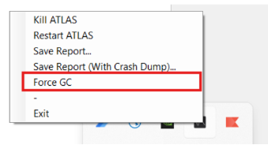

# Performance Guide

This guide covers settings on how to get the most out of your SQL Race installation by adjusting settings for better performance. 

## Cache Settings

The SQL Race cache is a key component of SQL Race memory management, designed to optimize data access time by keeping recently added or loaded data in memory. Operations in RAM are much faster than continuously reading and writing data directly from disk. Raw channel and event data is stored in memory in “slots” created during recording new data or loading historic data.

The cache settings can be modified and are stored by default in the configuration file 

SettingsStoreDefault.config located at:

`C:\Users\{USER.NAME}\Documents\McLaren Electronic Systems\SQLRace\Config\SettingsStoreDefault.config`

Applications can override the configuration file name. If the settings have never been changed, manually insert the following block of XML into the file within the `<SettingsStore>` tag:

```
<item name="eTCXlne314yJRUU1dwxAtw==">
    <Setting name="CacheSize" desc="CacheSize" readonly="false" value="1024" type="1" />
    <Setting name="PercentageToKeepFree" desc="PercentageToKeepFree" readonly="false" value="10" type="1" />
    <Setting name="PercentageToFree" desc="PercentageToFree" readonly="false" value="20" type="1" />
    <Setting name="MaximumSlotSize" desc="MaximumSlotSize" readonly="false" value="80000" type="1" />
    <Setting name="PartExpiryInMilliseconds" desc="PartExpiryInMilliseconds" readonly="false" value="10000" type="1" />
    <Setting name="MaximumTimeInMemoryBeforeFlushingingInSeconds" desc="MaximumTimeInMemoryBeforeFlushingingInSeconds" readonly="false" value="300" type="1" />
    <Setting name="MaximumTimeInMemoryBeforeFreeingInSeconds" desc="MaximumTimeInMemoryBeforeFreeingInSeconds" readonly="false" value="300" type="1" />
    <Setting name="ParameterDataPoolingSize" desc="ParameterDataPoolingSize" readonly="false" value="512" type="1" />
</item>
```

 To modify the settings, change the value for each setting in the XML.

### Available Settings

**CacheSize:** Maximum amount of memory (in MB) that SQL Race will use to cache raw data (default 1024).

!!! warning "Changing the settings below is not advisable. Contact MA for further support."

**PercentageToKeepFree:** The memory manager will attempt to keep at least this amount of cache available 
(default 10). 

**PercentageToFree:** Amount of the cache that should be freed when space needs to be made in the cache for 
new data (default 20).

**MaximumSlotSize:** Maximum size of memory slot (in bytes) that can be cached. A smaller slot size may mean 
less memory is wasted, but it also means that there will not be as much read-ahead benefit when loading the 
data back into the cache. Setting this to 85000 or higher will likely result in excessive allocations on the LOH, so 
it is recommended to keep below that (default 80000). 

**MaximumTimeInMemoryBeforeFlushingInSeconds:** Amount of time data will be kept in memory before flushing 
to disk (default 300). 

**MaximumTimeInMemoryBeforeFreeingInSeconds:** Amount of time data will be kept in memory before the 
memory is released (default 300). 

**ParameterDataPoolingSize:** The maximum size (in MB) of the pool of ParameterValues objects used to fulfill 
data requests. The objects are reused if possible, to reduce memory allocations and subsequent garbage 
collection (default 512).

### When to change the settings

For optimal performance, increase the “CacheSize” setting, assuming your system has enough free memory. A 
system with 16GB RAM should cope with the cache size increased to 2048. If ATLAS is used intensively with 
significant data throughput and the messages still appear, increase it to 3072 or even 4096, assuming the 
machine has enough available RAM.

| RAM Size (GB) | Recommended Cache Size (MB) |
|---------------|-----------------------------|
| 8             | 1024                        |
| 16            | 2048                        |
| 32            | 3072                        |
| 64            | 4096                        |

!!! tip
    If you see messages like: 
    
    > “Not enough memory freed. Flushing 14.864 MB immediately. Consider increasing your cache size” 
    
    in the log file, the SQL Race cache is filling up too quickly. This results in excessive memory allocations and disk activity as ATLAS and SQL Race move more data around to stay within the limit.

## Cache Folder

Caching data is a technique used to improve the performance and efficiency of applications. It involves storing frequently accessed data in a temporary storage location, such as memory or disk, which is faster to access than the original source. This reduces the time and resources needed to fetch data repeatedly from the main storage.

Consider deleting the SQL Race cache folder improved performance, better disk space management, reduced startup time, and enhanced stability by resolving issues related to corrupted cache files.

## C# Garbage Collection

C# uses an automatic memory management system called garbage collection (GC), managed by the Common Language Runtime (CLR). When you create a new object, memory is allocated for it on the managed heap, a region of memory reserved for .NET applications. 

The GC periodically checks for objects no longer in use by examining the application’s roots, such as static fields, local variables, and CPU registers. Unreachable objects are considered garbage, and their memory is reclaimed. After reclaiming memory, the GC compacts the remaining objects to reduce fragmentation and make memory 
allocation more efficient.

### SQL Race and Memory Disposal

SQL Race doesn’t release memory immediately when a session is disposed. Instead, the garbage collector (GC) plays a crucial role in managing memory. Typically, resources are released after about 5 minutes. However, if the system requires memory sooner, the GC will release the resources earlier to accommodate the demand. 

This approach helps optimize memory usage and ensures that the system runs efficiently.

### Force GC Option

Forcing garbage collection (GC) in ATLAS can have both benefits and drawbacks. On the positive side, it allows for immediate memory reclamation, which can be useful when you need to free up resources quickly. This can help optimize performance by reducing memory usage and preventing potential memory leaks.

However, there are also some downsides. Forcing GC can introduce performance overhead, as the process can be resource-intensive and may temporarily slow down the application. It can also lead to unpredictable behaviour, disrupting the normal GC cycle and potentially causing issues if not managed carefully.

{: style="width:50%;"}

!!! note
    The Force GC feature was implemented to assist our developers in managing stress and benchmarking tasks, enabling quicker resource release between tests.