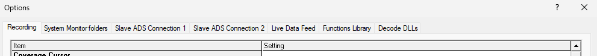
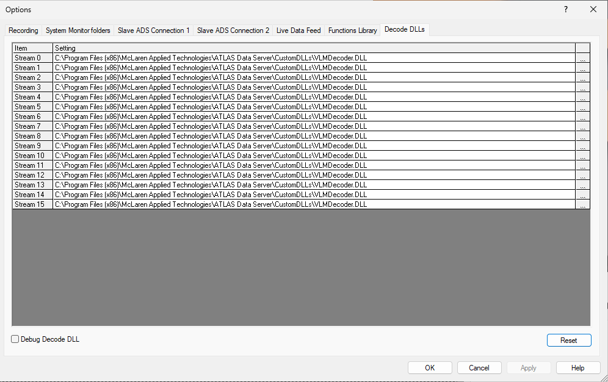

# Options Dialog

To access the options dialog box, go to `Tools > Options` in ATLAS Data Server (ADS).

Every setting on this page is also a key that can be set in the `ATLAS.ini` file or written directly
to the registry, which is how an ADS installation is configured without using this dialog. The
`ATLAS.ini` key column below gives the name to use — see the
[ATLAS.ini reference](atlas-ini.md) for how the file works.

!!! note "Version note"

    Settings, keys and defaults below reflect ADS 9.87.x. If you are running an older version, a
    setting or its default may differ from what is shown here.

!!! tip "Reading the tables"

    - **`ATLAS.ini` key** is both the INI key name and the registry value name. Unless stated
      otherwise it lives under `[ADSAdvancedSettings]`.
    - **Default** shows the ADS default, which for some settings differs from the ATLAS Viewer default
      for the same key.
    - **Restart** marks settings that only take effect after ADS is restarted.
    - Settings shown as TRUE/FALSE here are written as `1`/`0` in `ATLAS.ini`.

## Recording Tab

The Recording tab of the Options dialog box contains advanced settings used to configure the
Recording system. Settings are grouped in the dialog under the headings used below.

### Coverage Cursor

| Setting | `ATLAS.ini` key | Default | Restart | Description |
|---|---|---|---|---|
| Coverage Minimum Percentage (0-100) | `CoverageMinimumPercentage` | `98` |  | This option sets the minimum percentage of quads received before the Coverage Cursor moves to its next position. |
| Coverage Timeout (s) | `CoverageTimeout` | `60` |  | The maximum time allowed for the Coverage Minimum Percentage to be reached. The Coverage Cursor moves to its next position when the Coverage Timeout is exceeded. |
| Coverage Cursor Span (%) | `CoverageCursorSpanPercentage` | `50` |  | Controls how the coverage cursor is calculated on an incomplete block (under construction); not used for completed blocks. See the coverage cursor section for more info. |
| Quad sources excluded from coverage | `CoverageExcludedQuadSources` | `7` |  | Comma-separated list of streams to exclude from the coverage cursor calculation. See the coverage cursor section for more info. |
| Plot Coverage Percentage | `PlotCoveragePercentage` | FALSE |  | Plots coverage cursor % as a green line in the Data Server Statistic Panel; line height = percentage, time = delay. |

### Custom Decode DLL

| Setting | `ATLAS.ini` key | Default | Restart | Description |
|---|---|---|---|---|
| Custom quad buffer size in quads per source | `CustomQuadBufferSizeQuads` | `100000` |  | Buffer size to cover payload when data quads are missing (used for custom data logging units). |
| Load decode DLL at Startup | `CustomQuadDecoderload` | FALSE |  | When TRUE, loads the Decode DLL on application startup. |
| Unload decode DLL after recording | `CustomQuadDecoderUnload` | FALSE |  | When TRUE, unloads the Decode DLL after recording. |
| Max quads generic recorder groups before sending | `GenericRecorderMaxQuadsInGroup` | `10` |  | Limits max quads sent in one group so the generic recorder sends more often. |

### Data Server

| Setting | `ATLAS.ini` key | Default | Restart | Description |
|---|---|---|---|---|
| Data Servers | `WideBandDataServers` | Blank |  | List of ATLAS Data Server names and corresponding ports in the form `{Server:Port}`. |
| Wide Band local address | `WideBandLocalAddress` | ANY |  | Selects which network card is used for sending/receiving data; shows IPs of all NICs present. |
| Data Server connection timeout (ms) | `ServerConnectionRetryTime` | `20000` |  | Time ATLAS waits for data from a Data Server before stopping recording. |
| Server auto-refresh frequency (ms) [0=disable] | `ServerAutoRefreshFreq` | `2000` |  | Periodic refresh of current data servers shown in the Record dialog. |
| Server auto-refresh reply timeout (ms) | `ServerAutoRefreshReplyTimeout` | `100` |  | Time before a data server is deemed offline when no activity is detected. |
| Timeout for searching for Data Servers (ms) | `SearchForServersTimeout` | `0` |  | Time clients search for available Data Servers before timing out. |
| Server reply timeout [ms] | `ServerReplyTimeout` | `3000` | Yes | Time ATLAS waits for a reply from a Data Server. |
| Data Server Buffer size Mb | `WideBandBufferSize` | `20` | Yes | Size of client storage buffer for incoming data; should be large to avoid loss on poor networks. |
| Data Server Retries Enabled | `WideBandRetryMode` | FALSE | Yes | When TRUE, client may retry loading data from the network. |

### General

| Setting | `ATLAS.ini` key | Default | Restart | Description |
|---|---|---|---|---|
| Close record dialog after start/stop recording | `CloseRecDlgStopStart` | TRUE |  | If TRUE, Record dialog closes when Start/Stop clicked; if FALSE, stays open. |
| Show Record Error Messages | `ShowRecordErrors` | FALSE |  | When TRUE disables recording error pop-ups and writes errors to the Data Server log file. |
| Minimum Disk Space (MB) | `MinimumDiskSpace` | `500` |  | If free disk space drops below this value, recording stops (with warnings beforehand). Minimum value is 500MB. |
| Enable Record to Disk | `EnableRecordToDisk` | TRUE |  | When FALSE, data is only multicast to clients; no session is saved. |
| Quad sources excluded from lap trigger | `LapExcludedQuadSources` | Blank |  | Rejects lap triggers sourced from listed streams (comma-separated). |
| Virtual Memory Block Size (KB) | `MemoryBlockSize` | `1024` |  | Virtual memory slot size used by memory mapping in ATLAS. |
| Server Settings File | `SettingsFile` | `<WorkbookFolder>\AtlasServer.sbk` | Yes | Location of the server workbook (.sbk) holding Data Server configuration settings. |
| Auto Record connection check interval (ms) | `MonitorUnitStatusInterval` | `1000` |  | Time ATLAS waits before stopping Automatic Recording. |
| Unload unused Pgvs on Start Recording | `ClearPgvCacheOnStartRec` | FALSE |  | When TRUE, PGVs are removed from the cache when recording starts. |
| DTV Rename Cached Files | `RenameDtvCachedFiles` | FALSE |  | When TRUE, cached DTV files include `_Cached` in the filename; set 'Unload Unused PGVs on Start Recording' if cached file not required. |
| Auto Increment Run Number | `AutoIncrementRunNumber` | FALSE |  | Automatically increments Session Number name (e.g., R1, R2) for sequential recordings. |
| Hours to Delete Configs 0 = Disabled | `TimeInHoursToDeleteConfig` | `0` |  | Automatically delete obsolete config files to optimize resources. |
| Enable 'still processing parameters' Dialog | `EnableAbortSavedParamsDlg` | TRUE |  | Warns that parameter processing from config files is incomplete if recording ends prematurely. |
| Default disabled 'still processing parameters' to continue | `SavedParamsDlgDefaultContinue` | TRUE |  | Sets which button the 'still processing parameters' dialog defaults to. When TRUE the default is to continue, so an unattended recording is not held up waiting for a response. |
| Automatic Multicast Address | `AutomaticMulticastAddress` | FALSE | Yes | When TRUE, server derives Multicast IP from last three integers of Local IP bind. |
| Setup Recorders From Registry | `SetupRecordersFromRegistry` | FALSE | Yes | Saves Recorder settings in registry rather than with a Workbook. |
| Temporary directory for recording files (default: blank) | `TempRecordingDirectory` | Blank | Yes | If set, session files are written here first and copied to the data path when recording stops. If blank, they are written directly to the data path. |
| Transmission timeslice (ms) | `TransmissionTimeslice` | `10` |  | Period ADS sends multicast to the network (reducing may even peak load); 10ms should be minimum. |
| Delay Wirelink upload after recording (s) | `DelayWirelinkUpload` | `0` |  | Delay (seconds) for data upload from unit at end of recording. |
| Auto-dismiss config search dialog | `AutoDismissConfigSearch` | TRUE |  | When TRUE, config search box auto-closes. |
| Warn when config is missing | `WarnMissingConfig` | TRUE |  | Warns when a configuration file needed for a recording cannot be found. |
| Send missing configs to clients | `SendMissingConfig` | TRUE |  | Sends missing configuration files to clients that request them. |
| Recording event script | `RecordingEventScript` | Blank |  | User-defined script called in a new process on recording events (LIVE_STARTED, LIVE_STOPPED, OFFLOAD_STARTED, OFFLOAD_STOPPED). |
| SQL Data Service Instance | `SQLDataServiceInstance` | Blank | Yes | Name of the SQL Data Service instance used for SQL Race recording. Leave blank to use the default instance. |
| DTV Offload Exclusion List | `DTVOffloadExclusionList` | Blank | Yes | Keywords specifying DTVs to exclude from offload (supports application-level and unit-specific formats). |
| PGV Exclusion List | `ADSLDFPGVExclusionList` | Blank |  | Keywords specifying PGVs to exclude from processing at start of recording (application-level and unit-specific formats). |
| PGV Inclusion List | `PGVInclusionList` | Blank |  | Keywords specifying PGVs to include in processing; inclusion list overrides exclusion list. |
| PGV Standalone List (Hex) | `PGVStandaloneList` | Blank | Yes | Hexadecimal keywords identifying PGVs to be treated as standalone. |
| Auto Merge Option | `EnableAutoMerge` | Disabled |  | Drop-down: Disabled (sources only from .cfg), Maximum (all sources added), Minimum (one parameter added but merge performed on all sources; not selectable in ADS). |
| Process Weather.prm | `ProcessWeatherPgv` | FALSE |  | Processes `Weather.prm` during recording. |
| Process Scalar | `ProcessScalar` | FALSE |  | Processes scalar parameters during recording. |
| Enable Pre-Record Config Transfer | `EnablePreRecordConfigTransfer` | TRUE | Yes | When TRUE, allows sending config files when not recording. |
| Pre-Record Config Transfer Boost Time (s) | `PreRecordConfigTransferBoostTime` | `10` | Yes | Duration (seconds) that config send rate increases to boost rate. |
| Pre-Record Config Transfer Rate (KBps) | `PreRecordConfigTransferRate` | `50` | Yes | Raised config send rate used during boost time. |
| Enable New Unique Filter | `EnableNewUniqueMethod` | FALSE | Yes | Enables new unique filter and disables Missing Data Upload; allows Quad ID to wrap while still ensuring uniqueness on network. |
| Enable dual recording | `EnableDualRecording` | FALSE | Yes | Enables the out-of-process dual recorder, which writes a second copy of the recording via a separate process. |
| Dual recording end point | `DualRecordingEndPoint` | `[::1]:9798` | Yes | Endpoint of the dual recording process, in `host:port` form. The default is IPv6 loopback. |
| Dual recording SQL Race DB | `DualRecordingDB` | Blank | Yes | SQL Race connection used for the dual recording. |
| Dual recording SQL Race Recording Folder | `DualRecordingSqlRaceRecordingFolder` | `<DataFolder>\Server` | Yes | Folder the dual recorder writes SQL Race session files to. |
| Dual recording server listener IP | `DualRecordingServerListenerIP` | `127.0.0.1` | Yes | Local IP address the dual recording listener binds to. |
| Dual recording server listener port | `DualRecordingServerListenerPort` | `6800` | Yes | Port the dual recording listener binds to. |
| Enable FTP download | `EnableFTPDownload` | FALSE |  | Enables downloading data from a logging unit over FTP. |
| Enable Bridge Service | `EnableRemoteDataFeed` | FALSE | Yes | Master switch for the Bridge Service. When disabled, ADS makes no Bridge Service connection and the status indicator stays grey. |
| Bridge Service Endpoint | `RemoteDataFeedEndpoint` | `[::1]:9697` | Yes | Address of the Bridge Service in `host:port` form. Square brackets are required around an IPv6 literal; the default is IPv6 loopback. |
| Local Bridge Service | `LocalRemoteDataFeed` | FALSE | Yes | When enabled, ADS starts and stops the Bridge Service process itself. When disabled, it connects to a Bridge Service that is already running and leaves it running on exit. |
| *(not shown in dialog)* | `TempSqlRaceRecordingDirectory` | `<DataFolder>\Server` |  | Folder used for in-progress SSN2 recordings. Set automatically from `Temporary directory for recording files`, or the data folder, and not editable in the dialog. *Not editable in the dialog.* |

### Handshake Server

| Setting | `ATLAS.ini` key | Default | Restart | Description |
|---|---|---|---|---|
| Handshake Minimum Time [ms] | `HandshakeMessageTimeoutMin` | `100` |  | Minimum timeout for handshake message from data server to car. |
| Handshake Maximum Time [ms] | `HandshakeMessageTimeout` | `200` |  | Maximum timeout for handshake message from data server to car. |
| Handshake Message Queue Length | `HandshakeMessageQueueLength` | `2` |  | Maximum message queue length awaiting transmission. |
| Handshake Message Size | `HandshakeMessageSize` | `640` |  | Must match message size supported by embedded system. |
| Use Low Rate Message | `HandshakeMessageUseLowRateMsg` | FALSE |  | When TRUE, uses compressed handshaking messages. |
| Low Rate Maximum Time [ms] | `HandshakeMessageLowRateTimeout` | `2000` |  | Maximum time between low-rate handshaking messages. |
| Low Rate Maximum Message Size | `HandshakeMessageLowRateSize` | `18` |  | Maximum size of low-rate handshaking messages. |

### Advanced Data Feed

Settings for the Advanced Data Feed, which publishes recorded data to Kafka.
All of these require a restart.

| Setting | `ATLAS.ini` key | Default | Description |
|---|---|---|---|
| Enable Advanced Data Feed Producer | `ADFProducerEnable` | FALSE | Enables the Advanced Data Feed Kafka producer. |
| client.id | `client.id` | `ADS` | Client identifier presented to the Kafka brokers. |
| metadata.broker.list | `metadata.broker.list` | Blank | Comma-separated list of Kafka brokers to connect to. Required when the producer is enabled. |

#### Kafka client properties

The remaining 73 settings in this group are **librdkafka** producer properties. The key
name *is* the librdkafka property name, and the value is passed to the Kafka client
unchanged, so the librdkafka configuration reference is the authority on what each one
does. They are shown in the dialog but cannot be edited there — set them through
`ATLAS.ini` or the registry if you need to change them.

| `ATLAS.ini` key | Default |
|---|---|
| `builtin.features` | Blank |
| `message.max.bytes` | `1000000` |
| `receive.message.max.bytes` | `100000000` |
| `metadata.request.timeout.ms` | `60000` |
| `topic.metadata.refresh.interval.ms` | `300000` |
| `topic.metadata.refresh.fast.cnt` | `10` |
| `topic.metadata.refresh.fast.interval.ms` | `250` |
| `topic.metadata.refresh.sparse` | TRUE |
| `topic.blacklist` | Blank |
| `debug` | Blank |
| `socket.timeout.ms` | `60000` |
| `socket.blocking.max.ms` | `100` |
| `socket.send.buffer.bytes` | `1048576` |
| `socket.receive.buffer.bytes` | `1048576` |
| `socket.keepalive.enable` | FALSE |
| `socket.max.fails` | `3` |
| `broker.address.ttl` | `1000` |
| `broker.address.family` | `any` |
| `reconnect.backoff.jitter.ms` | `0` |
| `statistics.interval.ms` | `0` |
| `log_level` | `6` |
| `log.thread.name` | FALSE |
| `log.connection.close` | TRUE |
| `internal.termination.signal` | `0` |
| `quota.support.enable` | FALSE |
| `protocol.version` | `0` |
| `security.protocol` | `plaintext` |
| `ssl.cipher.suites` | Blank |
| `ssl.key.location` | Blank |
| `ssl.key.password` | Blank |
| `ssl.certificate.location` | Blank |
| `ssl.ca.location` | Blank |
| `sasl.mechanisms` | `GSSAPI` |
| `sasl.kerberos.service.name` | `kafka` |
| `sasl.kerberos.principal` | `kafkaclient` |
| `sasl.kerberos.kinit.cmd` | `kinit` |
| `sasl.kerberos.keytab` | Blank |
| `sasl.kerberos.min.time.before.relogin` | `60000` |
| `group.id` | Blank |
| `partition.assignment.strategy` | `range,roundrobin` |
| `session.timeout.ms` | `30000` |
| `heartbeat.interval.ms` | `1000` |
| `group.protocol.type` | `consumer` |
| `coordinator.query.interval.ms` | `600000` |
| `queued.min.messages` | `100000` |
| `queued.max.messages.kbytes` | `1000000` |
| `fetch.wait.max.ms` | `100` |
| `fetch.message.max.bytes` | `1048576` |
| `max.partition.fetch.bytes` | `1048576` |
| `fetch.min.bytes` | `1` |
| `fetch.error.backoff.ms` | `500` |
| `offset.store.method` | `broker` |
| `queue.buffering.max.messages` | `100000` |
| `queue.buffering.max.ms` | `1000` |
| `message.send.max.retries` | `2` |
| `retry.backoff.ms` | `100` |
| `compression.codec` | `none` |
| `batch.num.messages` | `1000` |
| `delivery.report.only.error` | FALSE |
| `request.required.acks` | `1` |
| `request.timeout.ms` | `5000` |
| `message.timeout.ms` | `300000` |
| `produce.offset.report` | FALSE |
| `auto.commit.enable` | TRUE |
| `enable.auto.commit` | TRUE |
| `auto.commit.interval.ms` | `60000` |
| `auto.offset.reset` | `largest` |
| `offset.store.path` | Blank |
| `offset.store.sync.interval.ms` | `-1` |
| `offset.store.method` | `file` |
| `consume.callback.max.messages` | `0` |
| `opaque` | FALSE |
| `ADFCompleteSessionsTimeout` | `60000` |

### Live Data Feed

| Setting | `ATLAS.ini` key | Default | Restart | Description |
|---|---|---|---|---|
| ldf.metadata.broker.list | `LiveData2ConnectionBrokerList` | Blank | Yes | Comma-separated list of Kafka brokers used by the Live Data Feed connection. |
| Enable Live Data Feed | `ADSLDFEnable` | FALSE | Yes | When TRUE, data can be transferred via live data feed. |
| Send All Data | `ADSLDFSendAllData` | FALSE |  | Sends all data over the Live Data Feed rather than only the requested subset. |
| Live Data Feed Retrieval Path | `ADSLDFFilePath` | `<Documents>\McLaren Electronic Systems\ATLAS 9\LDS` |  | Location used to store intermediate (LDR) files when using LDF. |

### Logging (Debug)

| Setting | `ATLAS.ini` key | Default | Restart | Description |
|---|---|---|---|---|
| Log File Folder | `LogFileFolder` | `<Documents>\McLaren Electronic Systems\ATLAS 9\log` |  | Location for log files. |
| Raw Data Logging | `RawDataLogging` | FALSE |  | Saves raw telemetry data during recording to .raw and .raw_tm files (for diagnostics). |
| Raw Data Root Folder | `RawDataRootFolder` | Blank |  | Location for files created by Raw Data Logging. |
| Raw Data Logging [VTS] | `RawVTSDataLogging` | FALSE |  | Saves VTS raw data during recording to .raw and .raw_tm files (for diagnostics). |
| Performance Statistics | `PerformanceCounterStats` | FALSE |  | When TRUE, creates performance log file (developer analysis/debugging). |
| Message log level (for debugging) | `MessageLogSetting` | Not Logging |  | Level of diagnostic message logging. Intended for support and development use. |
| Message log file size (MB) | `MaxLogFileSizeMB` | `5` | Yes | ATLAS log file size limit (0MB = infinite; new file created when limit reached). |

### Offload

| Setting | `ATLAS.ini` key | Default | Restart | Description |
|---|---|---|---|---|
| Enable Update Progress On Clients (3 Source) | `WireLinkUpLoadStatusBroadcast` | TRUE |  | Enables client update progress bar on ADS dialog during data upload. |
| Enable Multicast for Wirelink (3 Source) | `WireLinkMulicastControl` | TRUE |  | When TRUE, all three recording sources enabled in ADS Advanced Multi Source setup (may hinder network performance). |
| Exclude Offload Streams | `ExcludeOffloadStreams` | Blank |  | Prevent ADS from offloading specific unit streams (comma-separated list). Overrides may apply with Telemetry Streams setting. |
| Enable Reverse Upload | `EnableReverseUpload` | FALSE |  | Uploads missing data in reverse order, newest first. |
| Apps To Exclude From Clear Max/Min/Errors | `ExcludeAppsFromClear` | `CBT610;CBR610` |  | Semicolon-separated list of applications excluded when max/min values and errors are cleared on a logging unit. |
| Produce Encrypted Export Files | `ProduceEncryptedExportFiles` | FALSE |  | Encrypts export files produced at the end of a recording. |

### Remote Data Server

| Setting | `ATLAS.ini` key | Default | Restart | Description |
|---|---|---|---|---|
| Enable Remote Data Server | `ADSRDREnable` | FALSE |  | When TRUE, data can be transferred via the remote data server. |
| Remote Data Server Retrieval Path | `ADSRDRFilePath` | `<Documents>\McLaren Electronic Systems\ATLAS 9\RDS` |  | Location used to store intermediate (RDR) files when using RDS. |
| RDS Write to Log File | `RDS Write to Log File` | TRUE |  | When TRUE, RDS diagnostics written to an RDS log file in the main ATLAS log folder. |
| RDS Logging level | `RDSMessageLogSetting` | Minimum | Yes | Verbosity of Remote Data Server diagnostic logging. |
| Auto delete PARTIAL Sessions | `ADSAutoDeletePartialSSN` | TRUE |  | After playback when .ssn is created, delete PARTIAL live session file (when unlocked). |
| Enable RDR Transfer During Live (Master Only) | `ADSRDRTransferDuringLive` | FALSE |  | Enables ADS to transmit RDR data simultaneously with live recording if spare bandwidth available. |
| Enable Multi-Session RDR | `ADSRDREnableMultiSession` | FALSE |  | Allows the Remote Data Server to transfer more than one session at a time. |
| Enable VTS Session Save | `EnableRdsSaveVtag` | FALSE |  | Saves vTAG session data received over the Remote Data Server connection. |

### Telemetry

| Setting | `ATLAS.ini` key | Default | Restart | Description |
|---|---|---|---|---|
| Telemetry Guard Time (s) | `TelemetryGuardTime` | `0` |  | Reject data if timestamp difference between packets exceeds this value. |
| Telemetry Guard Filter Length | `TelemetryGuardSynchronizationLength` | `10` |  | Telemetry Guard synchronization length. |
| Telemetry Guard Quad Range Limit 0 = Disabled | `TelemetryGuardQuadRange` | `0` |  | Maximum allowable gap between sequential Quad IDs within a stream. |
| Live Telemetry Timeout 0 = Disabled | `LiveTelemTimeout` | `50` |  | For Marelli DST Receiver only: time after which ATLAS stops recording if no live data received (overridden by active Ethernet recorders). |
| Session Completion Timeout 0 = Disabled | `SessionTimeout` | `0` |  | Time (seconds) to stop recording after last data sample; 0 disables. |
| Enable VTS Session Completion Timeout | `VTSSessionTimeoutEnable` | TRUE |  | Allows VTS Recorder to timeout per Session Completion Timeout; FALSE overrides timeout. If timeout is 0, this has no effect. |
| Telemetry Streams To Complete Missing Offload | `TelemetryStreams` | Blank |  | Streams required for missing telemetry uploads before closing (comma-separated); uploaded first; live record status cleared after last stream completes; overrides Exclude Offload Streams. |
| Transmitter Status Timeout 0 = Disabled | `CBTStatusTimeout` | `0` |  | Time (seconds) that a status from a CBR600 is valid; after this time, last status ignored until a new one arrives. |
| Sequence number anti-wrap time (hours) 0 = Disabled | `AntiWrapTime` | `0` |  | Threshold delta time where sequence numbers auto-unwrap; applies only to current instance (forwarded data unaffected). |
| DST Interface Version | `DSTInterfaceVersion` | 3 | Yes | Version of the Magneti Marelli DST receiver interface to use. Must match the receiver in use. |
| SCS Logging Control Streams | `ScsTelemetryLoggingControlStreams` | `1,2` |  | Comma-separated list of streams used for Standard Communication System logging control. |

### Unit Comms

| Setting | `ATLAS.ini` key | Default | Restart | Description |
|---|---|---|---|---|
| Ethernet Receive Timeout (ms) | `EthernetReceiveTimeout` | `500` |  | Time ATLAS waits before retrying a receive message. |
| Ethernet Send Timeout (ms) | `EthernetSendTimeout` | `500` |  | Time ATLAS waits before retrying a send message. |
| Ethernet retries | `EthernetRetries` | `1` |  | Number of times ATLAS retries a message before aborting and showing a warning. |
| Ethernet upload message interval timeout (ms) | `EthernetUploadMsgTimeout` | `3` |  | Time before Quad Ethernet Telemetry data is re-requested during an upload (auto-extended if data receipt detected beyond timeout). |
| Ethernet upload message extended timeout (ms) | `EthernetUploadExtendTimeout` | `500` |  | Time ATLAS waits before Quad Ethernet Telemetry offload times out. |
| Ethernet offload connection retries  | `EthernetUploadConnectionRetries` | `10` |  | Number of reconnection attempts during offload if connection is lost. |
| Ethernet Minimum UDP Missing Request command size Limit | `EthernetMinimumMissingRequestLimit` | `512` |  | Minimum command size when requesting missing data to avoid IP fragmentation issues (steps down from maximum when timeouts occur). |
| Ethernet Maximum UDP Missing Request command size Limit | `EthernetMaximumMissingRequestLimit` | `1472` |  | Maximum command size when requesting missing data; may need adjustment if VPN introduces fragmentation. |
| Ethernet upload config unique response | `EthernetUploadCfgResponse` | FALSE |  | Setting must match client-specific BIOS configurations. |
| Enable missing data upload | `EnableMissingDataUpload` | TRUE |  | When TRUE, only data found to be missing is uploaded; when FALSE, all data uploaded regardless. |
| Ethernet Buffer Size (MB) | `EthernetBufferSize` | `5` | Yes | Size of local cache used for Direct Ethernet Wirelink. |
| Default Timeout (ms) | `DefaultTimeout` | `200` | Yes | Default timeout applied to unit communications that have no more specific timeout. |
| Enable Unit Status Message | `EnableUnitCfgStatusMessage` | TRUE | Yes | Enables the configuration status message sent to logging units. |

## Recorder Folders Tab

The Recorder Folders tab sets the paths ADS uses for configurations and parameter files. These keys
live under **`[Preferences]`**, not `[ADSAdvancedSettings]`.

| Setting | `ATLAS.ini` key | Description |
|---|---|---|
| System Monitor 7 base folder | `SystemMonitor7BaseFolder` | Path where System Monitor files are stored. Multiple paths can be separated with semicolons. |
| Logging configuration folder | `ConfigFolder` | Path where ADS writes logging configuration files. |
| Ancillary parameters folders | `AncilliaryParametersFolders` | Paths where logging configurations created in System Monitor are stored, semicolon-separated. Note the doubled `l` in the key name. |
| Parameter unlock list path | `ParameterUnlockListDir` | Path ADS searches for parameter unlock lists. Also passed to SQL Race as its unlock list search path. |
| Custom PGV path | `CustomPGVFolder` | Path where the LDF recorder stores received PGV files. |
| Cars database file | `CarDatabaseFile` | Path and file name of the car definitions file. Stored under `HKCU\Software\McLaren Electronic Systems`, not under the ATLAS 9.0 key, so it cannot be set from `ATLAS.ini`. |

Other `[Preferences]` paths that ADS uses but that are not on this tab — including `DataFolder`,
`WorkbookFolder` and `LocalFolder` — are listed in the
[ATLAS.ini reference](atlas-ini.md#preferences).

## Slave ADS Connection Tabs

Two tabs, **Slave ADS Connection 1** and **Slave ADS Connection 2**, configure outgoing connections
to slave data servers.

!!! note "Licence gated"

    These tabs only appear if the **Remote Data Server** licence option is present. Without it, both
    connections are forced off regardless of what is configured.

In the keys below `N` is `0` for the first tab and `1` for the second. The two connections must not
use the same port. `Allow connection` cannot be changed while a recording is in progress.

| Setting | `ATLAS.ini` key | Default (tab 1 / tab 2) | Description |
|---|---|---|---|
| Allow connection | `SlaveADSConnectionNEnable` | FALSE | Enables this slave connection. |
| Port | `SlaveADSConnectionNPort` | 5010 / 5011 | Port used for the connection. |
| Auto data rate | `SlaveADSConnectionNAutoRate` | TRUE | Adjusts the data rate automatically rather than using the fixed maximum. |
| Max data rate | `SlaveADSConnectionNMaxRate` | 500 | Maximum data rate in KB/s. |
| Min data rate | `SlaveADSConnectionNMinRate` | 0 | Minimum data rate in KB/s. |
| Compression | `SlaveADSConnectionNCompression` | FALSE | Compresses data sent over the connection. |
| Send VTAG data | `EnableVtagDataRdsConnectionN` | FALSE | Includes vTAG data in the connection. |
| Quad sources excluded | `SlaveADSQuadSourceNExcluded` | Blank | Comma-separated list of streams to exclude from this connection. |
| *(no control)* | `SlaveADSConnectionNRetransmission` | FALSE | Enables retransmission of lost data. |
| *(no control)* | `SlaveADSConnectionNMaximumSize` | 100 | Maximum block size before sending. |
| *(no control)* | `SlaveADSConnectionNMaximumTime` | 1 | Maximum time to wait before sending a partial block. |

## Live Data Feed Connection Tab

Configures the Live Data Feed connections. The broker list for the current connection is on the
Recording tab as `LiveData2ConnectionBrokerList`; the remaining keys are on this tab.

| Setting | `ATLAS.ini` key | Default | Description |
|---|---|---|---|
| Allow | `LiveData2ConnectionEnable` | FALSE | Enables the Live Data Feed connection. |
| Send VTAG data | `LiveData2SendVtagData` | TRUE | Includes vTAG data in the feed. |
| Data rate | `LiveData2ConnectionMaxRate` | Blank | Maximum data rate in KB/s. Blank applies no limit. |
| Quad sources excluded | `LiveData2ConnectionStreamsExcluded` | Blank | Comma-separated list of streams to exclude. |

!!! warning "Deprecated connections"

    The two numbered connections below are labelled **Deprecated** in ADS and are retained only for
    existing installations. Use the connection above for new configurations.

| Setting | `ATLAS.ini` key (`N` = 0 or 1) | Default (1 / 2) | Description |
|---|---|---|---|
| Allow | `LiveDataConnectionEnableN` | FALSE | Enables this legacy connection. |
| Port | `LiveDataConnectionPortN` | 5012 / 5013 | Port used for the connection. |
| Data rate | `LiveDataConnectionMaxRateN` | 150 | Maximum data rate in KB/s. |
| Send VTAG data | `LiveDataConnectionNSendVtagData` | TRUE | Includes vTAG data in the feed. |
| Quad sources excluded | `LiveDataConnectionStreamsExcludedN` | Blank | Comma-separated list of streams to exclude. |
| *(no control)* | `LiveDataConnectionMinRateN` | 50 | Minimum data rate in KB/s. |
| *(no control)* | `LiveDataConnectionCompressionN` | FALSE | Compresses data sent over the connection. |
| *(no control)* | `LiveDataConnectionAutoRateN` | FALSE | Adjusts the data rate automatically. |
| *(no control)* | `LiveDataConnectionEnableRowData` | TRUE | Includes row data in the legacy feed. |

!!! note

    `LiveDataConnectionNSendVtagData` follows a different pattern to the other keys — the index comes
    immediately after `LiveDataConnection`, giving `LiveDataConnection0SendVtagData`.

## Library Tab

Sets the function libraries loaded by ADS, and whether session constants are sent to clients.

| Setting | `ATLAS.ini` key | Description |
|---|---|---|
| Use server constants | `SendSessionConstantsToClients` | Sends session constants from the server to connected clients. Lives under `[AtlasDataServer]`. |
| Library list | `Defaults`, `DefaultsAttrib`, `Order`, `DefaultsType` | Function library entries, under the `ADSLibrary` key. ADS uses its own library key, separate from the ATLAS Viewer's. |

!!! note

    The library list values are multi-string registry values and **cannot** be set from `ATLAS.ini`.
    Configure them in the interface, or write them to the registry as `REG_MULTI_SZ`.

## Decode DLLs Tab

The Decode DLL tab is used to allocate customer-created DLLs to a data stream. A total of 15 data
streams are available.

| Setting | `ATLAS.ini` key | Description |
|---|---|---|
| Decode DLL Path | `CustomQuadDecoderFilepath` | Enter the full path and filename of the Decode DLL, or browse to locate it. The installer seeds this with the bundled `CustomDLLs\AtlasApiDecoder.dll`. |

Related settings are on the Recording tab under [Custom Decode DLL](#custom-decode-dll).

## System Monitor Folders Tab

The System Monitor Folders tab controls how ADS works with System Monitor configurations. These keys
are under **`[Preferences]`** and are the same values as the
[Recorder Folders tab](#recorder-folders-tab).

| Setting | `ATLAS.ini` key | Description |
|---|---|---|
| System Monitor 7 base folder | `SystemMonitor7BaseFolder` | Sets the path where System Monitor files are stored. Multiple paths can be separated with a semi-colon. |
| Logging configuration folder | `ConfigFolder` | Sets the path where ADS writes Logging configuration files. File structure must be: `…ATLAS V8\Config\Logging\AutoConfig` |
| Car definitions file | `CarDatabaseFile` | Sets the path and file name of the Car definitions file that defines network communication. |
| Ancillary Parameters Folder | `AncilliaryParametersFolders` | Sets the path where Logging Configurations created in System Monitor are stored. |
| Parameter Unlock List Path | `ParameterUnlockListDir` | Sets the path where ADS searches for Parameter Unlock Lists. |
| Custom PGV Path | `CustomPGVFolder` | Sets the path where the ADS LDF Recorder stores received PGV files. |

## Settings with no dialog control

These are read from `[ADSAdvancedSettings]` but have no control in the Options dialog. They are
included for completeness — most are internal or legacy, and should only be changed on advice from
support.

| `ATLAS.ini` key | Group | Default | Description |
|---|---|---|---|
| `WideBandInfoPort` | Data Server | 9696 | UDP port used to broadcast to and discover data servers. |
| `EnableADSTestMode` | General | FALSE | Enables ADS test mode. |
| `NarrowBandDataServer` | General | Blank | Legacy narrow band data server list. |
| `NarrowBandSequenceWindowLength` | General | 4 | Legacy narrow band sequence window length. |
| `NarrowBandWindowLength` | General | 10000 | Legacy narrow band window length. |
| `PreciseLapTimes` | General | TRUE | Enables precise lap time calculation. |
| `EnableAddFixedParameters` | General | TRUE | Adds fixed parameters to recorded sessions. |
| `EnableEthernetQuadTelemetry` | General | TRUE | Enables quad Ethernet telemetry. |
| `HandshakeMessagePLMN` | Handshake Server | 23415 | PLMN provider code used in handshake messages. |
| `HandshakeMessageTechnology` | Handshake Server | 2 | Network technology type used in handshake messages. |
| `HandshakeMessageUseSlowRowIP` | Handshake Server | FALSE | Uses the slow row for the IP address in handshake messages. |
| `broker.version.fallback` | Advanced Data Feed | `0.9.0.0` | Kafka broker version assumed when it cannot be determined. |
| `ADSSyncRDRFolderCheck` | Remote Data Server | TRUE | Checks the RDR folder synchronously. |
| `RDRPerformanceCounterSubsample` | Remote Data Server | 16 | Subsampling factor for RDR performance counters. |
| `AutoTelemTimeout` | Telemetry | 20 | Timeout used by automatic telemetry detection. |
| `EnableDstParameters` | Telemetry | FALSE | Enables DST-specific parameters. |
| `ScsLoggingControlCount` | Telemetry | 10 | Standard Communication System logging control count down. |

## Settings no longer in this dialog

If you are working from an older document or an existing `ATLAS.ini`, note that the following are
**not** ADS Options settings:

- **SQL Race logging and performance counters** — `SQL Race Logging Level`, `SQL Race Log File Path`,
  `SQL Race Logging Period`, `Enable SQL Race Perf Counters`,
  `Enable SQL Race Perf Counters Log to File`, `Enable SQL Race Background Metrics` and
  `SQL Race Cache Size` are no longer registered as ADS settings and have no effect if set. Configure
  SQL Race logging through SQL Race itself.
- **Session File Type** — chosen per recording in the Record dialog destination, not here.
- **Viewer-only settings** — `Wideband Min Lap Time`, `Record Telemetry Data From Start`,
  `Record Only Live Data`, `Unload Session on Start Recording`, `Save Client Config File to Disk`,
  `Use Only the Highest Rate Continuous Channel in Merging`,
  `Regenerate Merged Channels at the end of a Recording` and `PGV Request Timeout` exist in the ATLAS
  Viewer but are not shown or used by ADS.

## See also

- [ATLAS.ini reference](atlas-ini.md) — setting any of these keys from a file, for scripted deployment
- [Recorders](recorders.md) — recorder types and their settings
- [RDS](rds.md) — Remote Data Server configuration
