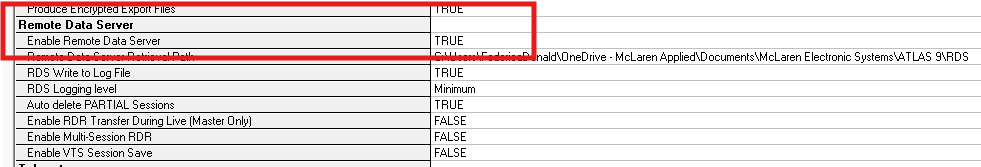
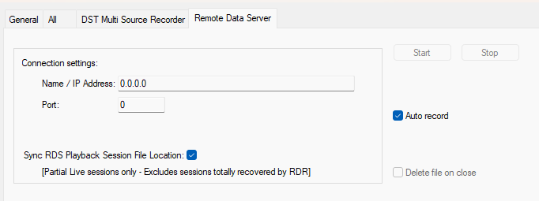

# Remote Data Server and Data Server Telemetry Recorder

The Remote Data Server enables listening to another ADS server across different networks over WAN connections. This functionality is essential for distributed teams, allowing factory floor personnel to access real-time data being transmitted from remote locations.

## Configuring Remote Data Server

1. On the ADS machine, go to `Tools > Options > Recording`

2. Find `Enable Remote Data Server` and set it to `True`

3. Go to the `Slave ADS Connection 1` tab and Allow Connection.

4. Click `OK` to save and close the Options window.

5. On the RDS machine, go to `Setup > Add > Remote Data Server` Recorder. 

6. Configure the recorder by entering the IP address and port of the ADS machine (as defined in Slave ADS Connection settings).

7. Turn Auto-Record on if you want the Remote Data Server to receive telemetry automatically when the main ADS starts a session.

8. Click `OK` to save the recorder settings.

!!! info "RDS Playback"
    When you enable **Sync RDS Playback File**, the system creates a playback file to recover lower-priority packets that were deprioritized during the session. This playback file can be upserted to the main session using the RDS Playback Recorder.

## Remote Data Server (RDS) Options

| Setting | Description |
|---------|-------------|
| **Allow connection** | Select to allow a Slave ADS to connect to the local ADS |
| **Port** | Port to be used by a Slave ADS |
| **Auto data rate** | Automatically adjusts data rate for optimum bandwidth usage |
| **Max data rate** | Maximum data rate in Kb/s (0 = unlimited) |
| **Min data rate** | Minimum data rate when Auto data rate is disabled |
| **Compression** | Select to apply data compression |
| **Data distribution** | Eliminates data banding by evenly distributing received packets |

## Data Server Telemetry Recorder

The Data Server Telemetry Recorder daisy-chains multiple data servers together by mirroring the primary Data Server stream to downstream clients.

!!! tip "Networking Considerations"
    - **Same Network:** Can be used when all Data Servers reside on the same network
    - **Different Networks:** Must use Remote Data Server recorders instead of DST recorders for cross-network deployment
    Remote Data Server lets you listen to another ADS server on a different network over WAN. This is used by teams so that people in the factory have access to the data currently being transmitted.  

