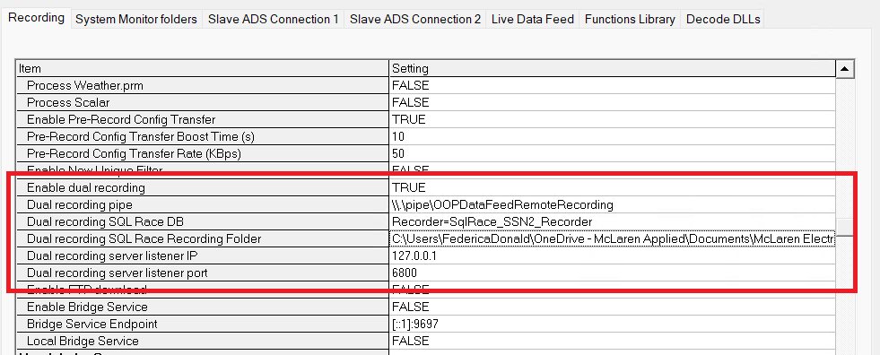
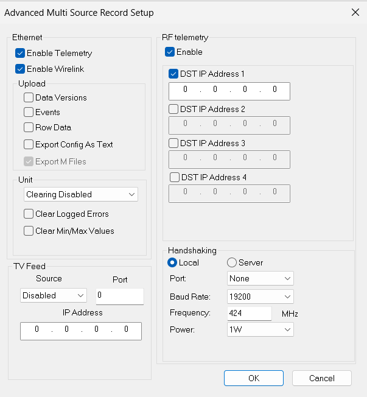

In ADS, a “recorder” is the configured input/output endpoint that defines how data enters ADS (protocol/device/source) and how/where it gets stored/offloaded/distributed. 

To access recorders, click `Setup > Add`

| Source | Description |
|--------|-------------|
| Ethernet Telemetry | Data is continuously uploaded while the car is connected via Ethernet. |
| Ethernet Wirelink | The contents of the data logging memory are uploaded when the car is connected via Ethernet. |
| RF Telemetry | Data is continuously uploaded while the car is transmitting Wide Band Telemetry. |

### General tab

The **General** tab is the first step in setting up ADS on your network.

Configure the following settings:

- Network parameters
- Status port for custom status monitoring services
- *(Optional)* Broadcast Streams for global telemetry and wirelink settings

### All tab

Use the **All** tab to define default session settings (details, export location, and so on) that apply to all future recorders on this ADS instance.

## Recorder types

### Dual Recorder

Dual Recorder writes to two different locations by duplicating the primary recorder.

To enable Dual Recorder:

1. Go to **Tools** > **Options** > **Recording** > **General**
2. Set **Dual Recorder** to `true`
3. Set the **Dual Recording SQL Race DB** to Recorder
4. Set the **Dual Recording SQL Race Recording Folder** path to where you want to save the data
5. Click **OK** to save

### DST Multi Source Recorder

A Multi Source Recorder automatically uploads data from available sources (Ethernet Telemetry, Ethernet Wirelink, or RF Telemetry). This ensures sessions use the best available data source at any time. Typically, Ethernet Telemetry operates in the pit, RF Telemetry on track, and Ethernet Wirelink offloads missed data.

Configure these options:

| Option | Description |
|--------|-------------|
| **Car number** | 1-4. Must match the value in System Monitor. |
| **Car** | Select a Car Definition from the drop-down list. |
| **Data source** | **DATA Lab Memory** (chassis parameters), **Burst Memory** (engine parameters), or **Burst and DATALab** (both). |

### TLM‑Px Multi Source Recorder

Before configuring the TLM-Px Recorder in ADS, The Telemetry Controller PC must be configured (VPN Agent Manager, Telemetry Controller Dashboard, and Telemetry Controller Interface). Once the Telemetry Controller is set up, follow these steps to configure the TLM-Px Multi Source Recorder in ADS:

1. Click `Setup > Add` and select TLM‑Px Multi Source Recorder
2. Select the car by unit IP (example: `172.27.92.26`)
3. In **Advanced settings** > **TLM‑Px** tab, set **Port number** to match the Control Telemetry Output UDP port(example: `4001`)
4. Configure other settings as needed 
5. Click **OK** to save

