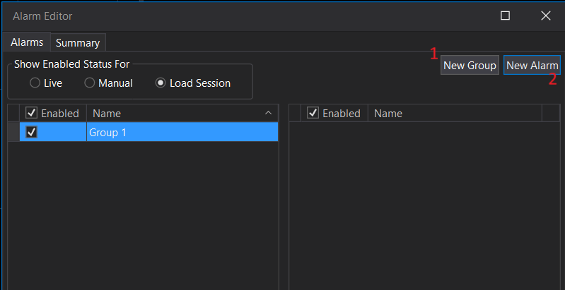
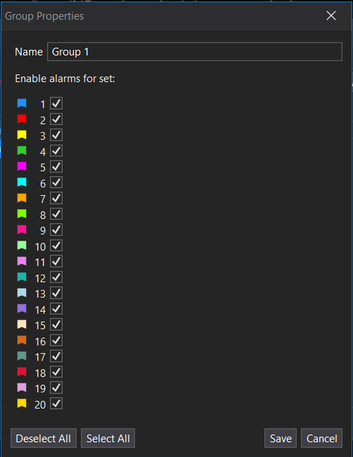
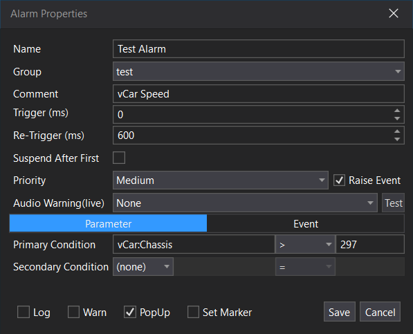
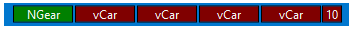
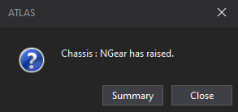
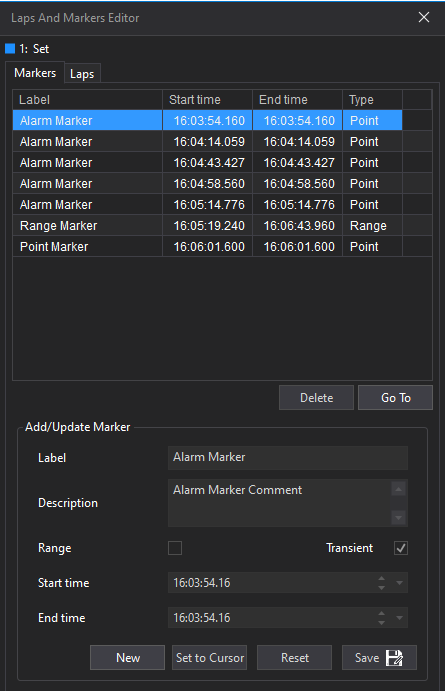
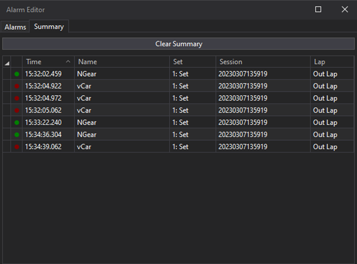

# Using Alarms in ATLAS

## Creating a new alarm

On the alarm itself you can define behaviour, conditions and actions. 

To create a new alarm go to `Tools -> Alarm Editor` and create or select an alarm group and then click `New Alarm`.

You can double click an alarm group to change which sets are active for the alarms in that group. This means that even if the condition of an alarm is met, it will not trigger from the parameters in that set if the group is not active for that set.

## Alarm Properties

### Alarm Conditions 

A parameter condition has a primary (required) and a secondary (optional) condition. The primary condition is the main condition that must be met for the alarm to trigger. The secondary condition can be used to add additional criteria that can also be satisfied for the alarm to activate. 

An event condition is based on an event ID and does not have primary or secondary conditions.

**Primary Conditions**

`Parameter + Operator + Value`

**Secondary Conditions**

`Logical Operator + Parameter + Operator + Value`

**Event Condition**

`Event ID`

### Alarm Actions

Actions are what happens when an alarm is triggered. 

**Warn**

If Warn is selected as an action, the Status Bar shows a running count and the last five raised alarms.

**Audio Warning**

If Audio Warning is selected as an action, a sound plays when the alarm triggers. You can configure the sound as None, Text-to-Speech, or Sound effect. 

**Pop-up**

If PopUp is an action, a dialog displays when the alarm triggers. Pop‑ups are configured in Options → Plugins with three modes: Per Alarm (reuse per alarm), Per Occurrence (new for each trigger), Shared (one shared dialog for subsequent triggers). 

**Log**

If Log is an action, entries are written to Alarm.log.

**Set Marker**

If Set Marker is an action, ATLAS places a transient point marker at the trigger time/distance, labeled with the Alarm Name and using the Comment as description. These markers are not persisted and are removed when the session unloads; you can view them via the Graphical Timeline dropdown and in [Laps and Markers Editor](../handling-data/laps-markers/markers.md).

## Monitoring 

Each triggered alarm will log in the Summary, listing priority, time, name, set, session and lap. Selecting an alarm in the Summary will highlight the trigger time in the session. 

