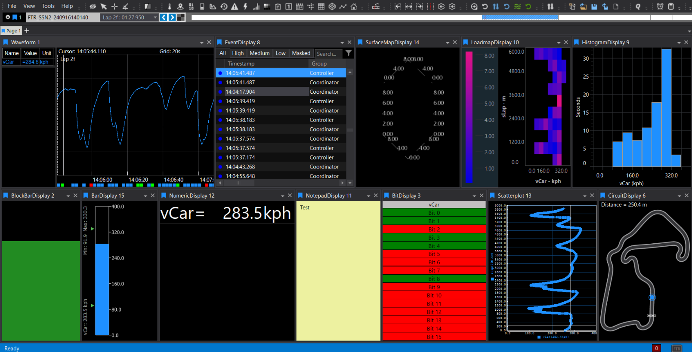
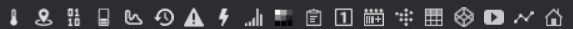

# Overview
An ATLAS Page can contain multiple Displays—each one is a visual (graph, table, map, or text) dedicated to showing one or more parameters from a Session. You add displays from the Display Toolbar, `File ▸ New ▸ Display`, or the Quick Access Assistant (press `Ctrl+Q` twice). Displays can be docked or floated, resized, and closed from their title bar. Only one display is “selected” at a time (click inside it).

Switching datasets quickly: If you’ve loaded multiple Compare Sets/Sessions, you can flip a selected display to another set using `Shift + (n)` (where n is the set number), or switch all displays on a Page with `Ctrl + (n)`. You can also click the coloured tag on a display or page title bar to pick a set. When a whole page shows the same set, a coloured line appears across the page header.

Adding data into a display: After opening a display, use the Parameter Browser to choose parameters. Many displays allow double‑clicking an item in the display (bar, axis, legend row, etc.) to open the Parameter Properties for fast formatting.

## Display Comparison

| Display Type   | What It Shows / Primary Capabilities | Key Features & Usage |
|----------------|-------------------------------------|----------------------|
| [**Waveform**](waveform.md)   | Multi-parameter time/distance traces with advanced analysis tools. | Visualise multiple signals (e.g., speed, throttle, brake) as traces over time or distance. Supports up to 100 parameters. Interactive legend, reference cursor, autoscale, event markers, live telemetry, context menu, keyboard shortcuts. |
| [**Scatterplot**](scatterplot.md)| 2D plot of Y vs X, with optional Z-axis colour mapping. | Plot relationships between two/three parameters. Up to five parameter sets. Best-fit/reference lines, interactive editing, custom draw styles, grid/axis labelling. |
| [**Histogram**](histogram.md)  | Distribution of a single parameter against time or distance. | Shows time/distance spent in each value range. Spectral/cumulative modes, adjustable bins, auto-refresh, context menu. |
| [**Loadmap**](loadmap.md)    | Pseudo-3D heatmap of time spent in ranges of one parameter vs. another. | Visualise time spent in combinations of two parameters. Adjustable buckets, colour bar, lap refresh. |
| [**SurfaceMap**](surface.md) | Interactive 3D graph based on two parameters mapped onto a mesh (.3d file). | Visualise surfaces (e.g., torque map). Mesh/data points in 3D, rotate/zoom, axis/grid customisation, requires .3d file. |
| [**Numeric**](numeric.md)    | Instantaneous numeric readout for up to 40 parameters. | Shows live values, auto-sizing, colour thresholds, rich formatting, double-click to edit. |
| [**Bar**](bar.md)        | Combined pictorial and numeric display of up to 12 parameters. | Vertical bars with numeric values, real-time updates, double-click to format, custom refresh/background. |
| [**Block Bar**](block.md)  | Minimalistic bar for a single parameter. | Quick graphic visualisation, conditional/gradient colouring, orientation options. Useful for dashboards. |
| [**Bit**](bit.md)        | Status bits of one or more parameters, with custom on/off colours and labels. | Visualise boolean/status flags, configure bits/captions/colours, supports .bcg files, layout options. |
| [**Summary**](summary.md)    | Lap-based statistics for selected parameters, as a table or plot. | Shows stats per lap (Min, Max, Mean, etc.), table or plot, resizable columns, snapshot export. |
| [**Circuit**](circuit.md)    | Track map from a circuit definition file, with car position and sectors/segments. | Shows car position, sectors/segments, shaded timebase, circuit editor, colour matches session tag. |
| [**PCU Dash**](pcu.md)   | Simulator of the McLaren Applied PCU Dash (steering wheel display). | Replicates real dash, supports multiple types, auto-load config, alignment/background options. |
| [**Event**](event.md)      | ECU events (from program version files), with priority and parameter snapshots. | Shows events by priority, timestamp, group, ID, description, tabs for filtering, masking, row colouring. |
| [**Error**](error.md)      | ECU errors during live connection, with status and timestamps. | Lists errors with status, name, description, timestamp, double-click to jump, filtering/masking, formatting. |
| [**Notepad**](notepad.md)    | Free-text notes for checklists and session details. | Store notes/checklists, custom fonts/colours, snapshot/copy, workflow documentation. |
| [**Bing Map**](map.md)   | Satellite map of the current location and surroundings. | Visualise GPS data, zoom/scale, GPS formats, lock map centre, track location context. |
| [**Web Browser**](web.md)| Embedded browser for web-based information. | Display live feeds/web content, set URL, show/hide controls, suppress script errors. |
| [**Countdown Timer**](countdown.md) | Configurable countdown clock or time offset display. | Set countdown/offset, custom text, font/colour/background options, session timing/reminders. |
| [**Video**](video.md) | Video display for related video (e.g., in-car camera) alongside session data. | Play synchronised video, enable via Preview Features, useful for driver analysis/event correlation. |

## Display Tools

### Display Properties

Every display has a **Display Properties** tool window (press `D` or right-click and select `Display Properties`) for formatting options specific to that display type. Many displays also have a context menu (right-click) with additional tools and shortcuts.

Properties can be:
- Default: Denoted with a square icon (◻️). Reset to default with the button.
- Changed for that instance only: Denoted with a diamond icon (♦️).
- Global: Denoted with a circle icon (⚪). Changes all future instances of that display type. You can right click a property to make, clear or reset global assignment. 

The meaning of each property can be found at the very bottom of the Display Properties window when you select it.

### Zoom

There are two types of Zoom operation:

- **X only**: Zoom in and out the X-axis only. Changes the Duration on the Timebase (Waveform Display only).

- **X and Y**: Zoom in both X and Y axes. Click and drag a Zoom Box to select and magnify any portion of the plot area in Waveform or Scatterplot displays. 

If the zoom region is drawn from top to bottom in a Waveform Display, a zoom box is defined in both X and Y axes. If the zoom region is drawn from bottom to top, a zoom strip is defined which zooms only in the X axis. The region is drawn as two vertical lines along the full height of the plot area.

In a Scatterplot Display, the zoom region can be drawn in either direction and is always shown as a box

### Columns

Some displays (e.g., Event, Error, Summary) have resizable/hideable columns. Hover at a header edge to resize; double‑click to auto‑fit. Fully hiding a column by shrinking width to zero can be reversed by grabbing the split‑line cursor and dragging open.

### Toolbar

The display toolbar has buttons for adding all displays quickly to the current workbook. Each icon represents a different display type. Hover over an icon to see its name. Click an icon to add that display to the current page.

