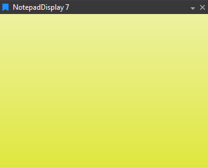

# Notepad Display

Free text notes for checklists and session details; useful to park instructions alongside data.

## Adding a Notepad Display

To add a Notepad Display to a Page do one of the following:

- Click the Notepad Display button  on the Display Toolbar.

- Click `File > New > Display` and select Notepad Display.

- Press `Ctrl + Q` twice to use the Quick Access Assistant and select New Notepad Display.

## Using the Notepad Display

The notepad display can be placed inside of another display's frame, in the legend area, or as a standalone display.

A Snapshot of the Notepad can be saved to a file. This can be saved as text or as an image.

1. Right click in the display.

2. Select either Snapshot to Data File or Snapshot to Image File.

A copy of the Notepad text can be saved to the Clipboard.

1. Right click in the display.

2. Select Copy to Clipboard.

Alternatively, press Ctrl + C to copy the Notepad text to the Clipboard.
