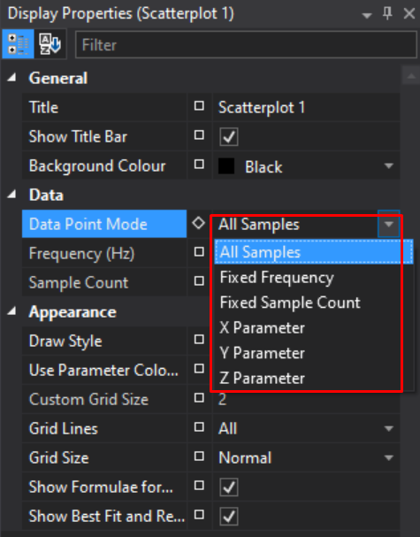
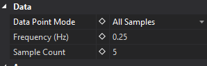
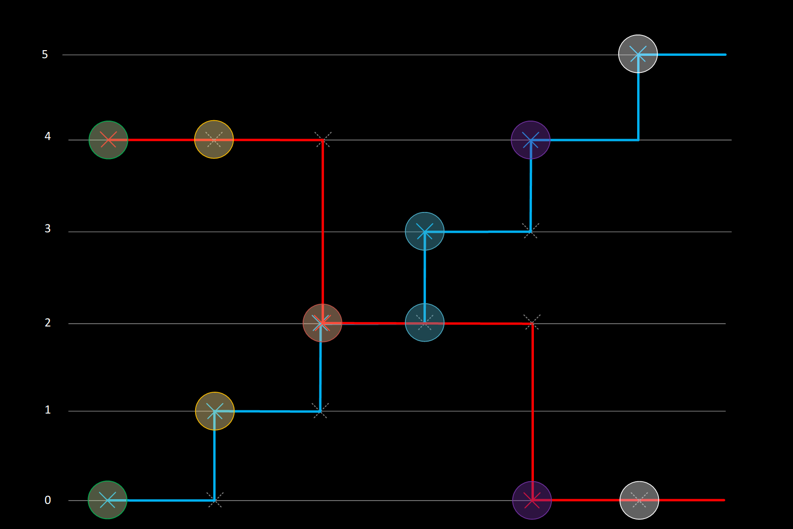
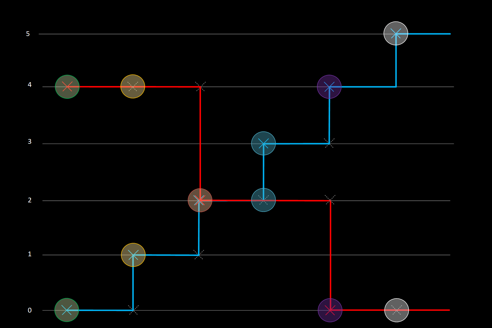
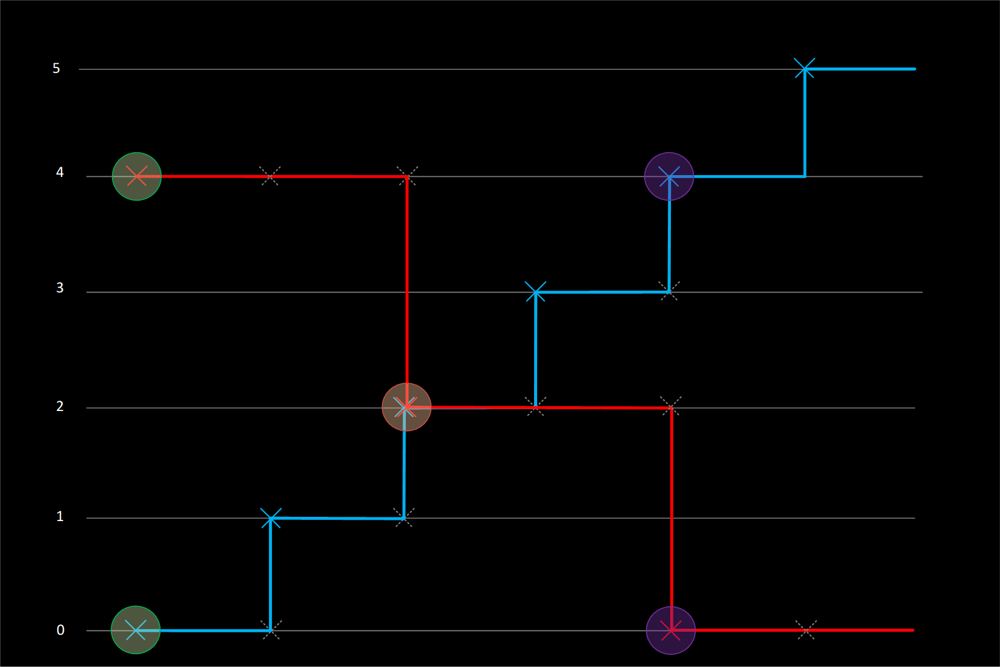
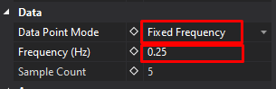
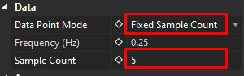
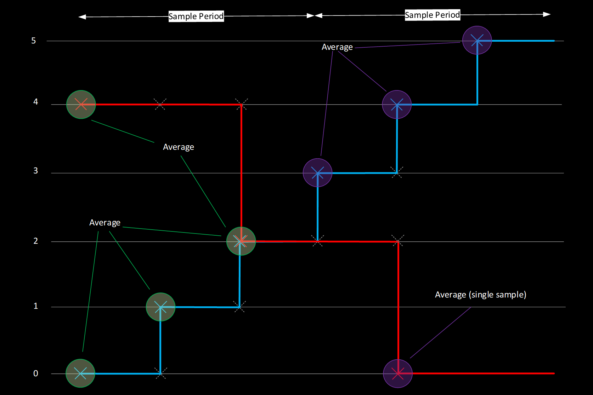

# Scatterplot Display

The Scatterplot is a two‑dimensional (X–Y) plot of one parameter against another, optionally colour‑mapped by a third Z parameter. It’s designed to reveal relationships and trends across sessions, with controls for sampling density, draw style, best‑fit curves, and engineering reference lines. Up to five parameter sets can be shown in one display.

## Adding a Scatterplot Display

To add a Scatterplot Display to a page, use one of the following methods:

- Click the **Scatterplot Display** button on the Display Toolbar.
- Go to **File > New > Display** and select **Scatterplot Display**.
- Press `Ctrl + Q` twice to open the QuickAccess Assistant, then select **New Scatterplot Display**.
- From a Waveform legend, select two parameters and use **View Scatterplot of Selected Parameters** (`Ctrl + T`) to create a Scatterplot pre-wired to those signals.

A third "Z" parameter can be selected to create a three-dimensional scatter plot.

### Adding the Z-axis

1. Press `P` on the display.
2. Click the **Use Z Axis** box.
3. Select the parameter from the list.
4. The Z-axis is scaled using a colour bar on the Scatterplot display.

## Best Fit & Reference Lines

### Opening the Editor

- Right-click the Scatterplot and choose **Edit Best Fit and Reference Lines…**.
- The editor lists all current lines with X/Y parameter binding, type (Best Fit or Reference), formula (for Reference Lines), and specified order (for Best Fit).

### Best Fit Lines

- Polynomial fit up to 5th order.
- **Order:**
    - *Unspecified*: ATLAS automatically selects the most accurate polynomial order (up to 5).
    - *Specified (1–5)*: Forces that exact order (e.g., 1 = linear).
- **Limits:** Define which samples are used for the fit (do not clip the drawn line). The calculated line spans the entire plot area.
- **Colour & Sessions:** Line colour defaults to the set’s colour. In compare mode, each Best Fit line is recalculated per session and uses the session colour. Custom colours apply only in single-session mode.

### Reference Lines

- Explicit formula: Supply coefficients for `Y = f(X)`. Use **Auto Calculate** to fill coefficients from the current sample set.
- **Limits:** Define where the line is drawn (limits do clip the rendered extent).
- **Colour:** Reference line colour is retained across sessions—one line per scatterplot.

### Placing a Linear Reference Line (Interactive)

- Choose **Place Linear Reference Line** from the right-click menu.
- A temporary white line with drag handles appears:
    - Drag centre to move; drag ends to pivot and stretch.
- Confirm to persist the line, then select which scatterplot set to apply it to.
- X/Y axis limits are inferred from handle positions. Changing the selected set updates coefficients and limits; manual tweaks are lost if you switch sets again.

### Line Lifecycle & Visibility

- **Automatic deletion:** Lines are tied to specific X/Y parameter pairs. Deleting X or Y, swapping axes, or replacing Z with X or Y deletes associated lines without warning. Undo does not restore them.
- **Global toggles:**
    - *Show Best Fit and Reference Lines* (on/off for all lines).
    - *Show Best Fit Line Formulas* (shows formulas under the X-axis).
- Per-line or per-set visibility toggles are not available.

!!! tip "Tips, Caveats & Troubleshooting"
        - If lines disappear after changing parameters, remember that changing X/Y (or swapping with Z) auto-deletes associated lines. Recreate them after the change.

        - If the plot feels cluttered, reduce density via Fixed Sample Count or switch Draw Style to Small Point or Cross.

        - If Z-colouring appears sparse, check the Z limits (Parameter Properties ▸ Appearance ▸ Limits). Points with Z outside limits are not drawn.
        
        - To focus on part of the lap/run, set a Reference Cursor on a Waveform and use the Scatterplot’s solid/faint point effect to isolate that window.

## Scatterplot Sampling Modes

In the ATLAS Scatterplot, there is a selection of different _Data Point Modes_.
The different _Data Point Mode_ selection alters the way in which the X, Y (and Z) samples are calculated for plotting co-ordinates on the scatterplot.

These can be accessed via the _Display Properties_ Window for the Scatterplot.

There are 6 different modes, each illustrated below with a worked example:

* All Samples
* Fixed Frequency
* Fixed Sample count
* X Parameter
* Y Parameter
* Z Parameter

This mode setting applies at a _display_ level, so any plots within that display inherit these properties.

### All Samples Mode
_ATLAS 10.4.1 and later_

!!! note
    In this mode, the _Frequency (Hz)_ and _Sample Count_ fields are ignored and read only.

_All Samples_ mode in ATLAS Versions &gt;= 10.4.1 operates by taking each sample of the Highest rate parameter, and referencing the sample and hold values of the other parameter(s). There is no averaging of samples, and only real values will be plotted. 

If the X Parameter is logged at 100Hz, and the Y at 10Hz, the Y parameter will effectively be super-sampled at 100Hz in order to plot a point for each X parameter sample. If super-sampling is not desired, we recommend creating a function(s) which down-samples parameters where required, such that X, Y (and Z) are all at the same rate. 

**Example**

| Time  | X Parameter Value (Blue) 2Hz   | Y Parameter Value (Red) 1Hz    | X Co-ordinate plotted  | Y Co-ordinate plotted  |
| ----- | --------------------------------- | --------------------------------- | ------------------------- | ------------------------- |
| 0.0   | 0                                 | 4	                                | 0	                        | 4                         |
| 0.5   | 1                                 |                                   | 1	                        | 4                         |
| 1.0   | 2                                 | 2	                                | 2	                        | 2                         |
| 1.5   | 3                                 |		                            | 3	                        | 2                         |
| 2.0   | 4                                 | 0	                                | 4	                        | 0                         |
| 2.5   | 5                                 |		                            | 5	                        | 0                         |

### X, Y, Z Parameter
_ATLAS 10.4.3 and later_

ATLAS 10.4.3 introduced 3 new modes in the scatterplot: X, Y and Z Parameter. 

These work in a similar manner to _All Samples_ mode &mdash; however instead of inferring the Highest rate parameter and using that to look up corresponding values on the other axes, the user can specify explicitly whether the X, Y or Z parameter is used as the "master".

**Example: X Parameter**

For every sample of the X Parameter, a corresponding vale of Y (or Z) is referenced regardless of the rate of these parameters:

| Time  | X Parameter Value (Blue) 2Hz   | Y Parameter Value (Red) 1Hz    | X Co-ordinate plotted  | Y Co-ordinate plotted  |
| ----- | --------------------------------- | --------------------------------- | ------------------------- | ------------------------- |
| 0.0   | 0                                 | 4	                                | 0	                        | 4                         |
| 0.5   | 1                                 |                                   | 1	                        | 4                         |
| 1.0   | 2                                 | 2	                                | 2	                        | 2                         |
| 1.5   | 3                                 |		                            | 3	                        | 2                         |
| 2.0   | 4                                 | 0	                                | 4	                        | 0                         |
| 2.5   | 5                                 |		                            | 5	                        | 0                         |

**Example: Y Parameter**

For every sample of the Y Parameter, corresponding samples of X (or Z) are referenced:

| Time  | X Parameter Value (Blue) 2Hz   | Y Parameter Value (Red) 1Hz    | X Co-ordinate plotted  | Y Co-ordinate plotted  |
| ----- | --------------------------------- | --------------------------------- | ------------------------- | ------------------------- |
| 0.0   | 0                                 | 4	                                | 0	                        | 4                         |
| 0.5   | 1                                 |                                   |  	                        |                           |
| 1.0   | 2                                 | 2	                                | 2	                        | 2                         |
| 1.5   | 3                                 |		                            |  	                        |                           |
| 2.0   | 4                                 | 0	                                | 4	                        | 0                         |
| 2.5   | 5                                 |		                            |  	                        |                           |

### Fixed Frequency and Fixed Sample Count Modes

_Fixed Frequency_ mode reads the _Frequency (Hz)_ field, but ignores _Sample Count_.

_Fixed Sample Count_ mode reads the _Sample Count_ field, but ignores _Frequency (Hz)_.

_Fixed Frequency_ &amp; _Fixed Sample Count_ modes calculate samples to plot in a very similar way.  
Both of these modes calculate a Time Period and then plot **averages** of X, Y or Z parameters over that Period.

* If a Period only spans a single sample, then the real sample value will be used;
* If the Period spans multiple samples, then those samples will be averaged.

The only difference between the modes is how the Time Period is calculated. 

**Fixed Frequency Period Calculation**

Fixed Frequency Sample Time Period is set by a frequency. 

_Time Period = 1/Frequency (Hz)_ 

If the Frequency is set to _0.25Hz_, then the Time period will be _4 seconds_ _(1/0.25)_.

**Fixed Sample Count Period Calculation**

Fixed Sample Count Time Period is set by splitting up the Display Time range, into a number of samples. 

_Time Period = Display Time Range / Number of Samples_

If the Display Time range is displaying _20 seconds_ of data (can be changed by Zoom Level), and the Number of Samples is set to _5_, then the Time Period will be _4 seconds_ _(20/5)_.

**Example: Fixed Frequency & Fixed Sample Counts**

<table>
    <thead>
        <tr>
            <th>Time</th>
            <th>X Parameter Value (Blue) 2Hz</th>
            <th>Y Parameter Value (Red) 1Hz</th>
            <th>X Co-ordinate plotted</th>
            <th>Y Co-ordinate plotted</th>
        </tr>
    </thead>
    <tbody>
        <tr>
            <th rowspan="3" style="writing-mode: sideways-lr">Sample Period 1 0-1.5 Seconds</th>
            <td>0</td>
            <td>4</td>
            <td rowspan="3">(0+1+2) / 2 = 1.5</td>
            <td rowspan="3">(4+2) / 2 = 3</td>
        </tr>
        <tr>
            <td>1</td>
            <td></td>
        </tr>
        <tr>
            <td>2</td>
            <td>2</td>
        </tr>
        <tr>
            <th rowspan="3" style="writing-mode: sideways-lr">Sample Period 2 1.5-3.0 Seconds</th>
            <td>3</td>
            <td></td>
            <td rowspan="3">(3+4+5) / 2 = 6</td>
            <td rowspan="3">0</td>
        </tr>
        <tr>
            <td>4</td>
            <td>0</td>
        </tr>
        <tr>
            <td>5</td>
            <td></td>
        </tr>
    </tbody>
</table>

In the example above, Sample Period of 1.5 seconds could be achieved in both _Fixed Frequency_  or _Fixed Sample Count_:

_Time Period (Fixed Frequency) = 1 / **0.667Hz**_

_Time Period (Number of Samples) = 6 (seconds on display) / **2 (samples)**_