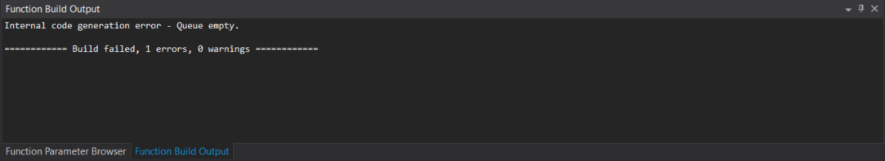
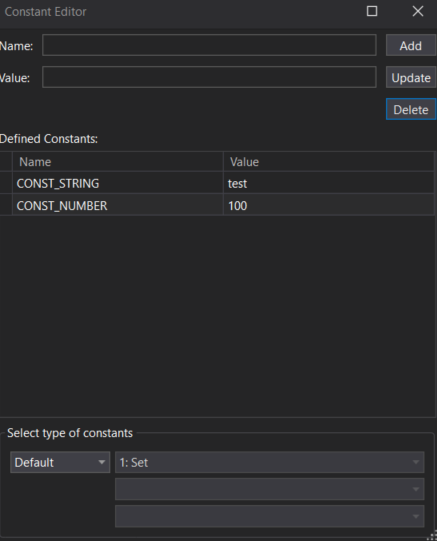

# Using the Function Editor

The Function Editor in ATLAS allows users to create, edit, and view Functions, which are used similarly to Parameters for data manipulation and display. Functions are written in the Function Definition Language (FDL) and can reference Parameters, Constants, other Functions, and Processors.


## Quick Start — Creating Your First Function

1. Open the Function Editor and click New. Default General and Function properties are prefilled. 
2. Set General Properties (name, format, units, display min/max). These act like parameter properties for Displays. 
3. Insert inputs from the Function Parameter Browser (use search; press Enter or double‑click to insert). You can include Parameters, Constants, Processors, or existing Functions. 
4. Write FDL in the Function Definition panel (see sections below). 
5. Build `(F6)` to check syntax. Success and errors appear in Function Build Output. 
6. Save the Function; it becomes available like any Parameter in Displays. 


!!! tip
    If your environment does not have Resolve without App Name enabled (Options ▸ Data), use the full parameter identifier (e.g., vCar:Chassis) rather than a short name. 

## Opening the Function Editor

- Click the **Function Editor** button on the Browser Toolbar.
- Select **View > Function Editor** from the Menu Bar.

## Function Editor Panels

1. **Function Browser**: Lists existing functions. Select to view properties; double-click to edit code.
2. **Properties**: Displays and allows editing of general and function-level properties.
3. **Function Definition**: Central text editor for writing function code. Each opened function appears in a new tab.
4. **Function Build Output**: Shows build progress, status, and errors.
5. **Function Parameter Browser**: Search and add Parameters, Constants, and Functions to your function.

## Editing Function Properties

### General Properties

- **Parameter Name**: Required. Used as the function's identifier.
- **Description**: Editable only in Function Editor.
- **Identifier**: Unique, read-only, auto-updated.
- **Format**: Output format (default `%5.2f`).
- **Units**: Display units (optional).
- **Display Minimum/Maximum**: Axis scaling (default 0.0/1000, required).


### Function Properties (how and when a Function calculates)

When a Function uses multiple inputs sampled at different times, choose how often and where to compute results: 

**Function Mode**

- Instantaneous (On‑the‑fly) — evaluates at every sample point of every input; results are not stored. Default for non‑historical Functions. 
- Coverage cursor based — computes from Session start to the coverage cursor; results are stored. Default for historical Functions. 
- Leading edge — computes once at the leading edge, skipping gaps. 

**Calculation Mode**

- Each sample point
- Fixed frequency (set Calculation Frequency (Hz) explicitly)
- Highest rate 

**Additional options**

- Calculate Over Whole Session — compute across the entire Session. 
- Interpolate Between Samples — interpolate values off the current sample; if off, uses most recent sample. 
- Join Gaps Around Null — joins gaps for instantaneous Functions during recording (no effect on historic data).


## Using the Function Parameter Browser

- Search for Parameters, Constants, or Functions from loaded sessions.
- Filter results by All Groups, Processors, or Constants.
- Add items to your function by double-clicking or pressing Enter.


## Function Build Output

- Displays build success or error messages.
- Syntax errors show line and position for troubleshooting.
- Execution errors are logged and disable the function until resolved.




## Writing Functions in FDL

**Parameters**

Insert Parameters in code with the $ prefix (e.g., $Vcar). Type $ then Ctrl+Space to list or filter available items. You may also insert via the Function Parameter Browser. If Resolve without App Name is off, use full identifiers (e.g., $vCar:Chassis)

**Variables and Arrays**

Define variables by assignment—no declarations needed; scope is per Function. Array subscripts can be expressions. Names can include letters, digits, and underscores, and must not clash with a Constant name.

**Expressions and Operators**

Expressions compute values using operators with a defined precedence (compatible with POSIX bc). Arithmetic (+ - * / % ^), relational (< <= > >= == !=), boolean (! && ||), bitwise (& ~ | >> <<), unary minus, and increment/decrement forms are supported. Parentheses () force evaluation order. Compound assignments (op=) evaluate the left side once (useful with arrays).

**Statements and Control Flow**

Statements control the sequence of evaluation of Expressions. You can use

```
if (...) [else ...]

while (...)

for ([e1];[e2];[e3])

break

continue (extension)

return(expression)
```

Newlines (or `;`) separate statements; you can hide a newline with `\\`. 


!!! note "null means “not a number”"
    Displays don’t plot or compute with null.

Always return a value in the first executed Function (because Displays use it).

**Comments**

Use `/* ... */`. Comments act as delimiters and can span lines; don’t split identifiers with comments.

**Referencing other functions**

You can call previously saved Functions by name followed by (), e.g., `FnSlip()`. Functions are pre‑calculated when a Display opens; Live inputs update incrementally.

For more information on available expressions in FDL view the [Processing Guide](processing.md).

## Working with Constants

Constants live outside Functions (global scope) in default_constants.txt:
`C:\Users\[username]\Documents\McLaren Electronic Systems\ATLAS 9\Config`

They can be numeric or string and are ideal for vehicle characteristics you reference across multiple Functions. If a Constant used by a Function is missing, the interpreter raises an execution error. 

**Constant Editor (open from Function Editor ▸ View ▸ Constants)**

- Add — enter Name and Value (string/number) and click Add.
- Update — select, edit Name or Value, then Update (changing Name creates a new Constant).
- Delete — select and Delete (confirm when prompted). 



**Types of Constants**

- Default — global, stored in default_constants.txt. 
- Session — stored within a specific Session; select Session type, then the Set and Session to view.

## Error Handling

- **Syntax Errors**: Detected during build; must be resolved before use.
- **Execution Errors**: Occur during function run; logged and disable the function.

Errors can also originate from Constants (missing/invalid) and Processors (e.g., invalid interpolation files).