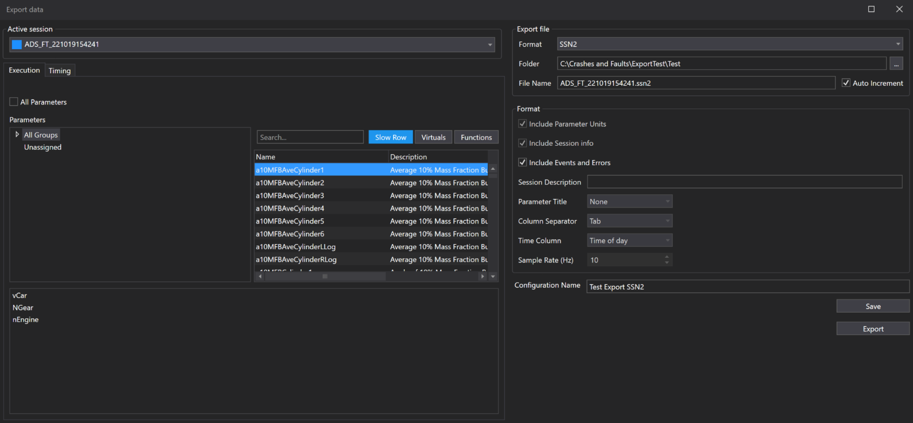
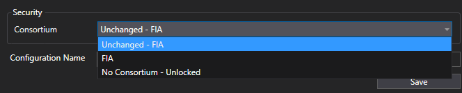

# Export Manager

The Export Manager helps you extract and save session data for analysis, reporting, or sharing. Use it to customize what data you export, how it's formatted, and where it's saved.

## Why Use the Export Manager?

- **Flexible Data Export:** Choose exactly which session data and parameters you need.
- **Multiple Formats:** Export to Text, Matlab, SSN2, or SQL Race Database.
- **Reusable Configurations:** Save export settings for future use.
- **Efficient Workflow:** Export directly from the Export Manager or the Export Data dialog.

## How to Use the Export Manager

1. **Open Export Data Dialog:**  
    Start by creating a new Export Configuration.

2. **Select Session:**  
    Pick the session to export from the drop-down list. Only sessions loaded via the Session Browser are available.

3. **Choose Parameters (Execution Tab):**  
    - Select specific parameters or use the "All Parameters" checkbox.
    - Filter by application group, channel type, or search by name.
    - Selected parameters appear in a list below.

    

4. **Set Timing (Timing Tab):**  
    - Choose laps to export or specify a custom time range.
    - Note: Custom time ranges work for text and Matlab exports. For composite sessions, only the first session is exported.

    

5. **Select Export Format:**  
    - Pick your desired format (Text, Matlab 1D/2D, SSN2, SQL Race DB).
    - Format-specific options (e.g., column separators for Text) will be enabled as needed.

6. **Configure Destination:**  
    - For SQL Race Database, select from available databases or add new connections via the Database Connection Manager.
    - For other formats, specify the file path.

    

7. **Save and Export:**  
    - Save your configuration for future use.
    - Click "Export" to run the export immediately. Progress is shown next to the Export button.

Use the Export Manager to streamline your data export process and ensure you get the data you need, in the format you want.

### Removing Team Security

As of version XXXXXX, Export Manager now allows users to remove team security during export. This enables sharing sessions with trusted external parties (e.g., suppliers) using a generic ATLAS license.

!!! info
    - Consortium selection only affects who can open the exported session. As a member of the original consortium, you can choose how data is restricted during export.
    - The exported session will only include parameters you have access to under your current license.
    - RDA restrictions always remain applied, regardless of consortium changes or “No Consortium” selection.
    - This feature is only available when exporting to SQLRace or SSN2 formats.

**How to Remove Team Security During Export:**

1. Open Export Manager and create a new export configuration.
2. Select the session(s) you want to export.
3. Choose the export format: SSN2 or SQLRace.
4. Select consortium restriction options:
    - Unchanged – Keeps the current consortium setting from the selected session. This option will change based on the session chosen.
    - No Consortium – Removes all team restrictions. The exported session can be opened by any ATLAS license.
    - Specific Consortium – Locks the export configuration to one consortium only, even if you later change the session.
5. Confirm export options:
    - If “All Parameters” is selected, RDA-locked parameters will not be exported.
6. Click Export or Save.