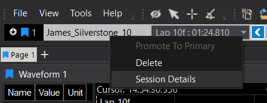
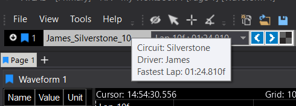

In ATLAS, a Lap is a defined segment of time within a telemetry session—typically corresponding to a vehicle completing a circuit. But laps are not just for motorsport. They are a powerful structuring tool for any time-series data stream where repeated cycles or phases occur.

Laps allow users to:

- Segment sessions into meaningful intervals
- Compare performance across repeated events
- Anchor analysis to specific time windows
- Drive automation in dashboards, alarms, and reports

**Timeline Session Details**

From ATLAS 11.2.3.460 onwards, users can now add information from session details to the Timeline. 

The list of all session details is provided on the right-click context menu on the session in the Timeline. 

The selected session details are visible as a tooltip by hovering over the specific session in the Timeline.

The number of session details that a user can add can be defined in Tools > Options > Plugins > F1 Timeline, the 
maximum number of session details allowed is 20. 

## Why Use Laps?

Laps are essential when:
- You want to compare multiple runs of the same test or event
- You need to isolate performance during specific phases (e.g. warm-up, cooldown, pit stops)
- You’re building dashboards or reports that rely on consistent time windows
- You want to automate workflows based on recurring patterns in the data

**Key Capabilities**

**1. Live Lap Tracking**

During a live session, ATLAS can track laps in real time. This is especially useful in motorsport or test environments where engineers monitor performance lap-by-lap.

- Laps are displayed as they are recorded
- The most recent lap is updated continuously
- Once the session ends, laps become editable

!!! warning
    In LIVE mode, laps are read-only. Editing is only enabled once the session becomes HISTORICAL.

**2. Manual Lap Definition**

You can define laps manually using the Laps and Markers Editor. This is useful when:

- The data source doesn’t emit lap markers
- You want to redefine laps based on new criteria
- You’re working with appended or stitched sessions

Manual laps can be:

*Precise:* down to the millisecond

*Flexible: *placed anywhere in the session

*Named:* with custom labels like “Out Lap”, “Pit Entry”, “Cool Down”

**3. Session Navigation**

Laps act as bookmarks in your session. You can:

- Jump to a lap instantly using the Go To button
- Use laps to drive cursor synchronisation across displays
- Filter displays or dashboards to show only data from a specific lap

**4. Comparative Analysis**

Laps are the foundation for overlaying and comparing telemetry data. For example:

- Compare throttle traces across laps
- Analyse tyre temperature evolution lap-by-lap
- Identify anomalies or trends across repeated cycles

ATLAS supports:

- Multi-lap overlays
- Delta comparisons
- Statistical summaries across laps

**5. Integration with Workbooks and Displays**

Laps can be used to:

- Drive conditional formatting (e.g. highlight fastest lap)
- Trigger alarms or annotations in dashboards
- Filter waveforms, histograms, or scatter plots to a specific lap
- Laps are not just metadata—they are active drivers of visualisation and logic in ATLAS.

**6. Out/In Lap Handling**

ATLAS supports special lap types:

*Out Lap:* typically the first lap after leaving the pits

*In Lap:* the final lap before returning to the pits

These are useful for:

- Excluding non-representative data from analysis
- Flagging laps with different operational contexts

**7. Appended Sessions and Lap Continuity**

When working with appended sessions (e.g. multiple test runs stitched together):

- Laps are preserved per session
- The first lap of each session is protected from deletion
- You can still define new laps across the combined timeline

This enables:

- Longitudinal analysis across multiple runs
- Consistent lap numbering even across session boundaries

## Advanced Use Cases for Laps in ATLAS

Laps are not just a convenience for motorsport—they are a strategic structuring mechanism for any telemetry-driven workflow. Below are advanced scenarios where laps become critical to extracting value from ATLAS.

### Performance Benchmarking Across Sessions

Laps allow engineers to:

Compare performance across different test runs, even if they span multiple sessions or vehicles.
Use lap overlays to visualise differences in throttle, brake, steering, or system behaviour.
Identify repeatable patterns or outliers in performance.

!!! example
     Compare Lap 3 from a baseline test with Lap 3 from a new configuration to quantify gains or regressions.

### Automated Report Generation

Laps can be used as reporting units:

- Generate lap-by-lap summaries of key metrics (e.g. max speed, average temperature, fuel usage).
- Export lap segments for external analysis or compliance documentation.
- Drive templated reports that automatically populate based on lap structure.

!!! tip
    This is especially useful in endurance racing, fleet testing, or regulatory validation.

### Triggering Alarms and Events

Laps can be used to:

- Trigger alarms when a parameter exceeds a threshold during a specific lap.
- Suppress alarms during out/in laps or cooldown phases.
- Log events tied to lap transitions (e.g. pit entry, system reset, driver change).

This enables context-aware alerting, reducing false positives and improving signal-to-noise ratio.

### Distance-Based Analysis

Laps enable distance-domain visualisation:

- Plot parameters against distance rather than time.
- Compare how systems behave at the same physical location across laps.
- Useful for track-based testing, proving grounds, or route-based validation.

!!! example
    Compare suspension travel at the same corner across multiple laps.

### Session Stitching and Longitudinal Studies

When sessions are appended:

- Laps maintain continuity across stitched sessions.
- Engineers can perform longitudinal analysis across days, drivers, or configurations.

Useful for durability testing, regression analysis, or multi-driver comparisons.

### Custom Lap Logic via Functions

Using ATLAS Functions (FDL), users can:

- Define custom lap logic (e.g. laps based on temperature cycles, not distance).
- Create virtual laps based on system states or external triggers.
- Use laps as inputs to derived parameters or conditional displays.
