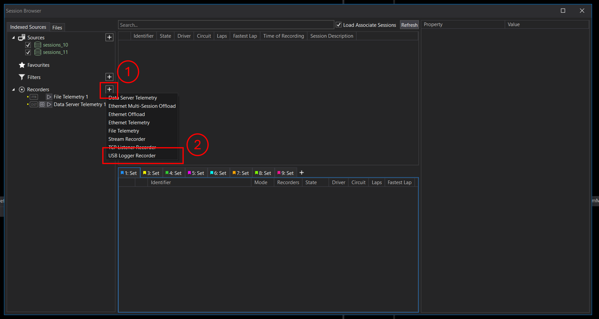
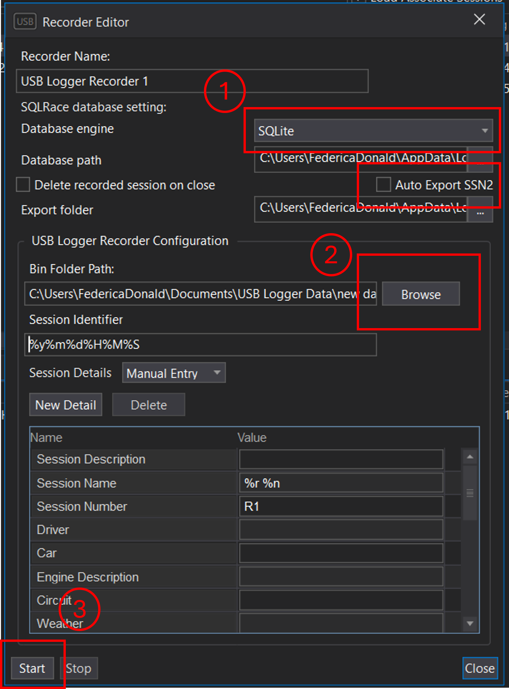
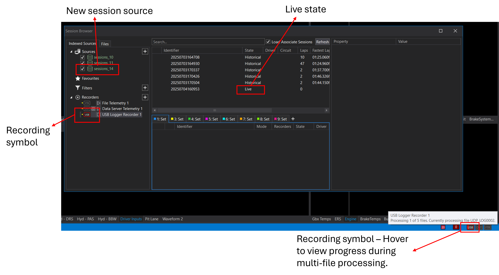
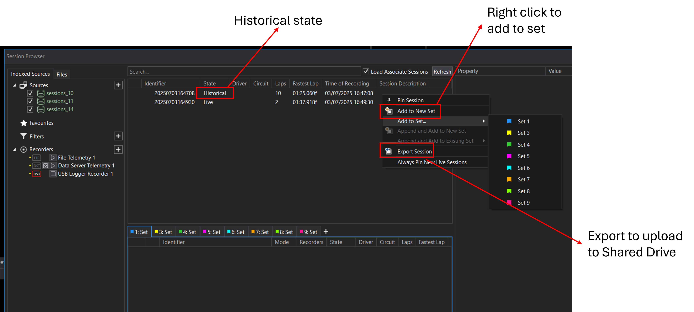

# Using the Motion Applied USB Logger with ATLAS

This guide provides a step-by-step overview of how to use a USB Logger system to collect, transfer, and visualise sensor data efficiently. It covers setup on the vehicle, data offloading procedures, and how to import and decode the data in ATLAS. Designed for flexibility, the system supports a range of operational environments.

## Prerequisites

- USB Logger Recorder License.
- ATLAS version 11.4.3.XXX or later.
- Motion Applied USB Logger unit.
- TAG320 or VCU-500. 

If you're interested in how Motion Applied can advance your data systems, contact [sales@motionapplied.com](mailto:sales@motionapplied.com).

---

## Setup

??? example "Prefer to watch a video demonstrating how to integrate the USB Logger with ATLAS?"
    <video controls style="width:50%">
      <source src="../assets/usb-logger/usb_logger.mp4" type="video/mp4" >
    </video>

**1. Connect the Logger to the ECU**

- Use an Ethernet cable to connect the ECU to the USB Logger.
- If you need quick access to the USB for session offloading, set the `log_destination` in `logger_config.json` to `usb_loom`. 

In this mode, the logger writes data through the loom to a USB stick placed in an easily accessible location for fast retrieval.

- *(Optional)* You can adjust other logger configurations by editing the `logger_config.json` file. Each field includes comments explaining its purpose and valid values.

!!! warning
    You can change the logger’s IP address in the `logger_config.jsonc` file under the `ethernet_settings` section.  
    The Logger IP address must be in the **same range** as the ECU IP address.

**2. Configure Logging from the ECU**

- Open **System Monitor**, connect to the TAG unit (e.g. TAG-320, TAG-510, or TAG-700), and in the **Explorer** tab navigate to: `BIOS > Data Acquisition > Telemetry > TLM-Px`.

- Locate the parameter `TLMPxIPAddress` and set it to the logger’s IP address from the `logger_config.jsonc`.

!!! tip 
    While the parameter may appear as `NTAG320TLMPxIPAddress` on TAG-320 units, other models like TAG-510 or TAG-700 may use a slightly different prefix. To ensure compatibility, look for the `TLMPxIPAddress` field under the **Telemetry > TLM-Px** section in the BIOS tree. This structure is consistent across supported TAG units.

- In ATLAS, go to **Tools > Options > System Monitor Folders** and set up the folders containing the required ECU configuration files (e.g., PGVs).

!!! info
    When the vehicle is powered on, the ECU will automatically begin logging data to the USB drive. Depending on session length, multiple `.bin` files may be generated.

**3. Swapping the USB**

- When the vehicle enters the pit, remove the used USB and insert a new one.
- The ECU will continue logging to the new USB without interruption.

**4. Insert the USB into a PC**

- Plug the USB into a PC using the adapter provided in the kit.
- Copy the `.bin` files to a local folder on your PC.
- After copying, you may delete the `.bin` files from the USB to prepare it for reuse.

!!! info

    Even if you accidentally delete the `logger_config.jsonc` file from the USB, the logger will **continue recording** using the last configuration it stored locally.

    When you plug the USB back into the logger it will **automatically restore the latest version** of `logger_config.jsonc` onto the USB. You can then **review or update the configuration** as needed.

**5. Add a USB Logger Recorder in ATLAS**

- Launch **ATLAS**.
- Open the **Session Browser** (`CTRL + L`) and create a new recorder.

{: style="width:75%;"}

- Set the following:
    - **Database engine** (where the data will be stored)
    - **Folder path** to the copied `.bin` file(s)
    - **Auto Export SSN2** *(optional)* to automatically export the created sessions to SSN2 once processing is complete. 

{: style="width:50%;"}

ATLAS will automatically detect and import multiple `.bin` files as separate sessions. 

!!! note
    When specifying the folder path, ensure that all required `bin` files are located directly within that directory. ATLAS will not process files located in subfolders.

**6. Start the Recorder**

- The recorder will process each binary file individually, creating a new session per `bin` file. If *Auto Export SSN2* was selected when configuring the recorder it will export the converted `.ssn` files to the export folder after processing is finished.
- You can monitor progress via the status bar located in the bottom-right corner of ATLAS.

{: style="width:75%;"}

!!! warning
    The USB Logger Recorder does not record in the same way as other recorders. Behind the scenes it replays existing data and generates a historical session file from the replay.
    As a result you cannot drag the USB Logger recorder into a Set until it has finished converting the data. This recorder is **not** used for real-time replay.

**7. Using the Data**

- Once the session is fully read and marked as **Historical**, it will appear in the **Sources** panel.
- You can import the session into a **Set** using **Append** or **Compare** mode, like any other historical data.

{: style="width:75%;"}

Depending on the selected database engine:

- **SQLite**: Share the exported `.ssn` file via a network drive.
- **SQLRace**: Team members with access to the database can view the session directly.

---

## Use Cases

The USB Logger system is designed for flexibility and ease of use across a wide range of environments and industries. Example applications include:

**Extreme Environments**
Water-resistant design allows use in harsh weather or rugged terrain.

**Limited Storage**
Ideal for systems where the ECU has limited onboard storage capacity.

**Endurance Operations**
Supports long-duration sessions where quick data offloading is essential.

**Difficult Access**
Enables data retrieval without needing direct physical access to the ECU.

**Limited Telemetry Bandwidth**
Provides a fast alternative to telemetry for transferring session data.

**Scalable for Small Teams**
Runs directly on an engineer’s PC without requiring advanced setup. Can be integrated into larger systems later using tools like the SQLRace API.
