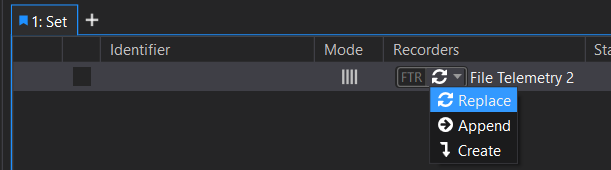

## [What is a Recorder?](../recorders/usb-logger.md)

A Recorder in ATLAS is a tool that captures live telemetry data from a vehicle and stores it in an SQL Race database. Recorders are configured and managed through the Session Browser.

Supported Recorder Types
You can choose from several Recorder types depending on your data acquisition setup:

- Data Server Telemetry
- Ethernet Telemetry
- File Telemetry
- Ethernet Multi-session Offload Data Recorder
- TCP Listener Recorder
- NASCAR Recorder (requires a NASCAR licence)

Each type corresponds to a specific method of receiving telemetry data.

### Adding and Configuring a Recorder
1. Open the Session Browser.
2. Click the Add Recorder button.
3. Select the appropriate Recorder type.
4. Configure the Recorder settings as required.

Once added, the Recorder appears in the Recorders panel.

### Starting a Recording

To begin recording Click Start on the Recorder.
    - Depending on the Recorder type, data may begin streaming immediately or wait for a trigger.

!!! note
    Starting a Recorder does not automatically load the Session into a Set. You must manually add the Session to a Set to view and analyse it.

When a Recorder is added to a Set, you must define its mode. This determines how new recordings are handled in relation to existing Sessions.

**Mode: Create**

*Function:* Each new recording creates a new, separate Session.

*Behaviour:* Previously recorded Sessions remain in the Set as Historic Sessions.

*Use Case:* Ideal for capturing multiple independent runs or tests.

**Mode: Replace**

*Function:* Each new recording replaces the previous Session in the Set.

*Behaviour:* Only the most recent Session is retained.

*Use Case:* Useful for iterative testing where only the latest data is relevant.

**Mode: Append**

*Function:* Each new recording is appended to the existing Sessions in the Set.

*Behaviour:* Multiple recordings are merged into a single Composite Session.

*Use Case:* Best for continuous data collection across multiple runs or phases.

Composite Sessions created via Append mode are displayed as a single timeline in ATLAS. Green line separators indicate where individual Sessions have been joined.

## What is a Historic Session?

A Historic Session is a previously recorded Session stored in the SQL Race database. These Sessions can be loaded into ATLAS for review, comparison, or further analysis.

Loading Methods
You can load Sessions into a Set using the Session List in the Session Browser:

1. Double-click a Session to add it to the currently selected Set.
2. Drag and drop a Session into a Set.
3. Right-click a Session and choose:
    - Add to New Set: Creates a new Set and adds the Session.
    - Add to Set: Adds the Session to an existing Set.
4. Drag one Session onto another in the Set list to create a Composite Session.
5. Select multiple Sessions using Shift or `Ctrl + Click`, then:
    - Right-click and choose Append and Add to New Set.
    - Right-click and choose Append and Add to Set.

## What is a Compare Set?
A Compare Set is a group of one or more Sessions (or Composite Sessions) loaded together for side-by-side analysis. Compare Sets are essential for:

- Comparing different runs or configurations
- Analysing performance trends
- Identifying anomalies or inconsistencies

You can create a Compare Set in several ways:

1. Double-click a Session in the Session List.
2. Drag and drop a Session into the Sets panel.
3. Right-click a Session and select Add to New Compare Set.
4. Select multiple Sessions and:
    - Right-click and choose Add to New Compare Set.
    - Drag them into the Sets panel.

Adding to an Existing Compare Set:

1. Drag a Session onto an existing Set in the Sets panel.
2. Select multiple Sessions and drag them onto an existing Set.

### Viewing and Managing Compare Sets

The Compare Sets List (also called the Set List) shows all active Sets.

1. Click a Set tab to expand and view its Sessions.
2. Click the arrow next to a Composite Session to view its components.
3. Right-click a Session to remove it from the Set or press Delete.

Customising the Compare Sets View

1. Right-click column headers to add or remove metadata fields.
2. Changes apply to both the Compare Sets List and the Session List.

## What is a Composite Session?

A Composite Session (also known as an Appended Session) is a single Session formed by appending multiple Sessions together. This is useful for:

- Continuous data collection across multiple runs
- Reducing clutter by merging related Sessions
- Aligning data for comparative analysis

Creating Composite Sessions

- Historic Data: Load a Session into a Set, then drag additional Sessions onto it.
- Live Data: Use a Recorder in Append mode. Each new recording is automatically appended to the previous one.
Composite Sessions appear as a single timeline in ATLAS, with green separators marking the boundaries between original Sessions.

