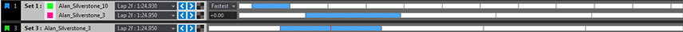

# Timebase and Timeline Usage

Each Display in ATLAS has a **Timebase**, defined by:

- **Start and End Point**: The time range covered.
- **Duration**: The length of time shown.
- **Position**: A specific point within the Timebase.

**Default Settings**: Timebase duration and position are based on the absolute time in the active Session. Displays can have independent or linked Timebases—changes to a linked Timebase affect all associated Displays.

### Adjusting the Timebase

You can change the Timebase in several ways:

- **Position & Duration**:  
    - Use the Graphical Timeline  
    - Use Move controls
- **Position Only**:  
    - Move the cursor in Waveform, Circuit, or Scatterplot Displays
- **Duration Only**:  
    - Use Zoom controls in the Waveform Display

When telemetry is received, the Timebase position updates automatically.

## Timeline Overview

The **Timeline** is shown at the top of the ATLAS Main Window when a Session or Compare Set is loaded. It provides graphical control over the Timebase and lets you navigate, select laps, and compare data.

### Timeline Components

- **Set Tag**: Indicates which Session or Compare Set the Timeline applies to.
- **Set Name**: Shows driver and session description.
- **Lap Selection**: Select laps to change the Timebase.
- **Marker Selection**: Jump to specific points or ranges using markers.
- **Navigation Buttons**:  
    - Previous Lap  
    - Next Lap  
    - Fastest Lap
- **Lap Bar**: Visualizes session duration and lap boundaries.
- **Time Position**: Marked by a vertical red line.
- **Compare Set Scope & Offset**: Choose what to compare (whole session, single lap, fastest lap) and set time offsets between sessions.

## Timeline Actions

Interact with the Timeline using your mouse and keyboard:

- **Double-click a lap**: Selects the whole lap as Timebase, centers Time Position.
- **Triple-click**: Selects the entire session as Timebase.
- **Click + Drag**:  
    - Left to right: Select any duration  
    - Right to left: Select whole laps
- **Right-click**: Remove sessions or manage Compare Sets.
- **Left-click a Set tag/number**: Show/hide Compare Sets.
- **Right-click session identifier**: Promote to primary, delete, or view session details.
- **Zoom**: Use `+` and `-` keys or mouse wheel to zoom in/out on the Timeline.

## Timebase vs Distance Mode

The **Waveform Display** supports two modes:

- **Time Mode** (default): Parameters plotted against time.
- **Distance Mode**: Parameters plotted against distance.

**When to use each mode:**

- Use **Time Mode** for time-based analysis (e.g., event timing, telemetry trends).
- Use **Distance Mode** for lap comparison, performance over track segments, or when assessing lap time improvements.

### Switching to Distance Mode

1. Select a valid Distance parameter in `Tools > Options > General > X Axis Mapping`.
2. Add and configure the Distance parameter (e.g., `sLap`).
3. In the Waveform Display, press `K` to toggle modes, or right-click and select the mode from the context menu.

When Distance Mode is active, a Time Difference (TDiff) function is shown, helping you compare lap times and performance.

## Timeline Visibility

Timelines are visible if any display is associated with their Set. You can force visibility by right-clicking the Set marker and checking the Sets to always display. To show all Timelines, use `View > F1 Timeline > Show All Compare Sets`.

## Session Details Tooltip

Hover over the session identifier in the Timeline to see session details. Customize which properties are shown by right-clicking and selecting `Session Details`. You can select up to 5 properties (default limit, configurable).

